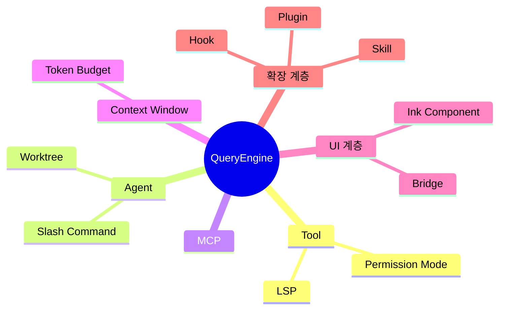

# 핵심 개념 (Key Concepts)

## 개요

Claude Code 코드베이스를 이해하려면 상호 긴밀하게 연결된 15개의 핵심 개념을 파악해야 한다. 이 개념들은 크게 세 계층으로 분류된다: LLM 호출과 도구 실행을 조율하는 **엔진 계층** (QueryEngine, Tool, Agent, Context Window, Token Budget), 외부 시스템과 통합하는 **프로토콜 계층** (MCP, LSP, Bridge), 그리고 동작을 확장하고 제어하는 **확장 계층** (Permission Mode, Skill, Plugin, Hook, Slash Command, Worktree, Ink Component). 각 개념의 소스코드 위치와 상호 의존 관계를 함께 파악하면 전체 아키텍처를 빠르게 내면화할 수 있다.

---

## 개념 목록

### 1. Tool (도구)

- **정의**: LLM이 호출할 수 있는 실행 단위로, 입력 스키마(JSON Schema), 실행 로직(`call` 메서드), 권한 검사(`isEnabled`, `isReadOnly`)를 하나의 객체로 캡슐화한다. `src/Tool.ts`의 `ToolUseContext` 타입이 실행 시점에 필요한 모든 런타임 정보(현재 메시지 목록, 파일 상태 캐시, 앱 상태 접근자 등)를 Tool에 주입한다.
- **소스코드 위치**: `src/Tool.ts` (인터페이스 및 타입), `src/tools/` (40+ 개별 구현체)
- **관련 문서**: [Level 2 — Tool 심층 분석](../level-2-systems/tool-system.md)
- **핵심 포인트**:
  - `ToolPermissionContext`가 `DeepImmutable`로 감싸져 있어 실행 중 권한 규칙이 변경되지 않음을 타입 수준에서 보장한다.
  - `src/tools.ts`에서 `assembleToolPool()`로 조립되며, `USER_TYPE === 'ant'` 환경 변수와 feature flag에 따라 일부 Tool이 조건부로 포함된다 (예: `REPLTool`, `SleepTool`).

---

### 2. Agent (에이전트)

- **정의**: 독립적인 메시지 컨텍스트와 시스템 프롬프트를 가지고 비동기 또는 동기로 실행되는 서브프로세스 단위다. 메인 스레드의 `AgentTool`이 `runAgent()`를 호출해 서브에이전트를 스폰하며, 서브에이전트는 별도의 `AgentId`와 자체 `ToolUseContext`를 부여받아 격리된 환경에서 작동한다.
- **소스코드 위치**: `src/tools/AgentTool/AgentTool.tsx`, `src/tools/AgentTool/runAgent.ts`, `src/tools/AgentTool/forkSubagent.ts`
- **관련 문서**: [Level 2 — Agent 심층 분석](../level-2-systems/agent-coordinator.md)
- **핵심 포인트**:
  - `isolation: 'worktree'` 파라미터를 전달하면 에이전트가 격리된 git worktree 내에서 실행된다 (`createAgentWorktree()` 호출).
  - `isCoordinatorMode()` 플래그에 따라 코디네이터 모드로 전환되며, 이 경우 에이전트는 팀원(Teammate) 서브에이전트들에게 작업을 위임한다.

---

### 3. QueryEngine (질의 엔진)

- **정의**: Claude LLM API 호출과 Tool 실행 루프 전체를 관리하는 핵심 엔진이다. 사용자 요청을 받아 메시지를 조립하고, API를 호출하고, 응답에서 Tool 호출을 추출해 실행한 뒤, 그 결과를 다시 컨텍스트에 추가하는 반복 루프를 구동한다.
- **소스코드 위치**: `src/QueryEngine.ts`
- **관련 문서**: [Level 2 — QueryEngine 심층 분석](../level-2-systems/query-engine.md)
- **핵심 포인트**:
  - Context Window 관리, Token Budget 추적, Tool 실행 권한 검사, Hook 실행이 모두 QueryEngine 루프 안에서 조율된다.
  - `refreshTools` 콜백을 통해 MCP 서버가 실행 도중 추가로 연결되어도 Tool 풀을 동적으로 갱신할 수 있다.

---

### 4. MCP (Model Context Protocol)

- **정의**: 외부 서버에서 제공하는 도구(Tool)와 리소스(Resource)를 Claude Code에 연결하는 표준 프로토콜이다. `@modelcontextprotocol/sdk`를 기반으로 구현되며, MCP 서버는 stdio 또는 SSE 채널을 통해 통신한다.
- **소스코드 위치**: `src/services/mcp/` (특히 `client.ts`, `types.ts`, `MCPConnectionManager.tsx`)
- **관련 문서**: [Level 2 — MCP 심층 분석](../level-3-internals/mcp-lsp-integration.md)
- **핵심 포인트**:
  - `channelPermissions.ts`와 `channelAllowlist.ts`가 MCP 채널별 권한과 허용 목록을 별도로 관리해, 신뢰하지 않는 외부 서버의 Tool 호출을 제한할 수 있다.
  - `useManageMCPConnections.ts` 훅이 React 컴포넌트 생명주기와 MCP 연결 수명을 동기화한다.

---

### 5. LSP (Language Server Protocol)

- **정의**: 코드 인텔리전스(정의 이동, 진단, 심볼 검색 등)를 제공하는 언어 서버와의 통신 프로토콜이다. Claude Code는 LSP 클라이언트로서 언어 서버를 관리하고, LLM이 LSPTool을 통해 코드 지식을 쿼리할 수 있게 한다.
- **소스코드 위치**: `src/services/lsp/` (특히 `LSPClient.ts`, `LSPServerManager.ts`, `LSPDiagnosticRegistry.ts`)
- **관련 문서**: [Level 2 — LSP 심층 분석](../level-3-internals/mcp-lsp-integration.md)
- **핵심 포인트**:
  - `LSPDiagnosticRegistry.ts`가 각 파일의 진단 결과를 캐싱해, LLM이 파일 저장 없이도 최신 타입 에러를 조회할 수 있다.
  - `passiveFeedback.ts`는 에이전트가 파일을 편집할 때마다 LSP 진단 결과를 수동적으로 수집해 피드백으로 활용한다.

---

### 6. Permission Mode (권한 모드)

- **정의**: Tool 실행 요청을 자동 승인할지, 사용자 확인을 요구할지, 또는 거부할지를 제어하는 보안 모델이다. `PermissionMode` 타입이 `'default'`, `'acceptEdits'`, `'bypassPermissions'`, `'plan'` 등의 모드를 정의하며, `ToolPermissionContext`가 이를 각 Tool 실행 시점에 전달한다.
- **소스코드 위치**: `src/types/permissions.ts`, `src/Tool.ts` (`ToolPermissionContext` 타입), `src/hooks/useCanUseTool.tsx`
- **관련 문서**: [Level 2 — Permission 시스템](../level-2-systems/permission-system.md)
- **핵심 포인트**:
  - `alwaysAllowRules`, `alwaysDenyRules`, `alwaysAskRules`가 소스별(`ToolPermissionRulesBySource`)로 분리되어, 설정 파일·CLI 인수·사용자 세션 등 규칙의 출처를 추적할 수 있다.
  - `shouldAvoidPermissionPrompts` 플래그가 `true`이면 UI를 표시할 수 없는 백그라운드 에이전트에서 자동으로 권한 요청을 거부한다.

---

### 7. Slash Command (슬래시 커맨드)

- **정의**: `/`로 시작하는 사용자 입력 명령어로, 마크다운 파일(`.claude/commands/*.md`) 또는 코드 내 `Command` 객체로 정의된다. `loadSkillsDir.ts`에서 frontmatter를 파싱해 명령어 인수 치환, 실행 모델 지정, 허용 도구 목록 등을 구성한다.
- **소스코드 위치**: `src/skills/loadSkillsDir.ts`, `src/types/command.ts`, `src/utils/markdownConfigLoader.ts`
- **관련 문서**: [Level 2 — Slash Command](../level-2-systems/command-system.md)
- **핵심 포인트**:
  - frontmatter의 `allowed-tools`, `model`, `effort` 필드를 통해 각 명령어가 사용할 수 있는 Tool, 모델, 처리 강도를 개별 지정할 수 있다.
  - `$ARGUMENTS` 치환(`substituteArguments()`) 메커니즘으로 사용자가 입력한 텍스트를 프롬프트 템플릿에 동적으로 삽입한다.

---

### 8. Ink Component (Ink 컴포넌트)

- **정의**: React 기반의 CLI UI 프레임워크인 [Ink](https://github.com/vadimdemedes/ink)를 사용해 터미널에 렌더링되는 UI 컴포넌트다. 각 Tool은 `renderToolUseMessage()` 같은 함수를 통해 실행 상태를 JSX로 반환하고, QueryEngine이 이를 `setToolJSX()` 콜백으로 화면에 전달한다.
- **소스코드 위치**: `src/tools/AgentTool/UI.tsx`, `src/components/` (전체 UI 컴포넌트), `src/Tool.ts` (`SetToolJSXFn` 타입)
- **관련 문서**: [Level 2 — UI 렌더링 시스템](../level-2-systems/ui-ink-components.md)
- **핵심 포인트**:
  - `SetToolJSXFn`의 `shouldHidePromptInput` 플래그로 Tool 실행 중 사용자 입력창을 숨기거나 표시할 수 있다.
  - React Compiler(`react/compiler-runtime`)가 적용되어 있어 상태 변경에 따른 리렌더링이 자동으로 최적화된다.

---

### 9. Context Window (컨텍스트 윈도우)

- **정의**: LLM API 호출 시 전송되는 대화 이력의 범위다. 메시지 목록(`Message[]`)이 누적됨에 따라 토큰 한계에 근접하면 QueryEngine이 오래된 내용을 요약(compact)하거나 Tool 결과를 압축하는 전략을 실행한다.
- **소스코드 위치**: `src/utils/context.ts`, `src/utils/analyzeContext.ts`, `src/Tool.ts` (`CompactProgressEvent` 타입, `onCompactProgress` 콜백)
- **관련 문서**: [Level 2 — Context 관리](../level-3-internals/context-compression.md)
- **핵심 포인트**:
  - `CompactProgressEvent`의 `pre_compact`, `post_compact`, `session_start` 훅 타입이 컴팩션 생명주기의 세 지점에 외부 훅을 삽입할 수 있음을 보여준다.
  - `contentReplacementState`(`ContentReplacementState`)가 Tool 결과 예산을 추적하고, 예산 초과 시 내용을 참조 링크로 대체해 컨텍스트 크기를 줄인다.

---

### 10. Token Budget (토큰 예산)

- **정의**: API 호출에서 소비되는 토큰 수를 추적하고 비용 상한(`maxBudgetUsd`)을 적용하는 메커니즘이다. 에이전트별 토큰 카운터가 진행 중인 작업 추적기(`createProgressTracker()`)와 연동되어 총 사용량을 실시간으로 집계한다.
- **소스코드 위치**: `src/utils/tokenBudget.ts`, `src/utils/tokens.ts`, `src/Tool.ts` (`maxBudgetUsd` 옵션)
- **관련 문서**: [Level 2 — Token Budget](../level-2-systems/query-engine.md)
- **핵심 포인트**:
  - `ToolUseContext.options.maxBudgetUsd`로 세션 단위 비용 상한을 설정할 수 있으며, 초과 시 새 API 호출을 차단한다.
  - 서브에이전트는 `getTokenCountFromTracker()`로 자신의 토큰 사용량을 부모 에이전트에게 보고한다.

---

### 11. Skill (스킬)

- **정의**: 마크다운 파일로 정의된 재사용 가능한 워크플로우 단위로, Slash Command와 유사하지만 `skills/` 디렉토리에 묶여 배포 가능한 단위(Plugin의 구성 요소)로 존재한다. `loadSkillsDir.ts`가 frontmatter를 파싱해 `PromptCommand` 또는 MCP 기반 스킬로 변환한다.
- **소스코드 위치**: `src/skills/loadSkillsDir.ts`, `src/skills/bundledSkills.ts`, `src/skills/mcpSkillBuilders.ts`
- **관련 문서**: [Level 2 — Skill 시스템](../level-3-internals/plugin-skill-system.md)
- **핵심 포인트**:
  - `bundledSkills.ts`에 등록된 스킬은 빌드 시점에 번들에 포함되며, 마켓플레이스에서 설치한 외부 스킬과 런타임에 병합된다.
  - `mcpSkillBuilders.ts`는 MCP 서버가 제공하는 프롬프트를 Skill 형식으로 변환해 동일한 슬래시 커맨드 UI로 노출한다.

---

### 12. Plugin (플러그인)

- **정의**: 여러 컴포넌트(스킬, 훅, MCP 서버, 슬래시 커맨드)를 하나의 배포 단위로 묶는 외부 확장 시스템이다. `{name}@builtin` 형식의 ID를 가진 빌트인 플러그인과 `{name}@{marketplace}` 형식의 마켓플레이스 플러그인으로 구분된다.
- **소스코드 위치**: `src/plugins/builtinPlugins.ts`, `src/types/plugin.ts`, `src/plugins/bundled/`
- **관련 문서**: [Level 2 — Plugin 시스템](../level-3-internals/plugin-skill-system.md)
- **핵심 포인트**:
  - `registerBuiltinPlugin()`으로 등록된 빌트인 플러그인은 `/plugin` UI에서 사용자가 활성화/비활성화할 수 있으며, 설정이 사용자 설정 파일에 영속된다.
  - 플러그인은 `isAvailable()` 함수를 통해 현재 환경에서 사용 가능 여부를 런타임에 판단하고, 불가능한 경우 목록에서 제외된다.

---

### 13. Bridge (브릿지)

- **정의**: VS Code, JetBrains 등 IDE와 Claude Code CLI 간의 양방향 통신 레이어다. IDE 확장이 브릿지 API 서버에 접속해 세션을 생성하고, CLI는 폴링 또는 웹소켓을 통해 IDE의 컨텍스트(현재 열린 파일, 선택 영역 등)를 수신하고 작업 결과를 IDE에 돌려준다.
- **소스코드 위치**: `src/bridge/bridgeMain.ts`, `src/bridge/bridgeApi.ts`, `src/bridge/bridgeMessaging.ts`, `src/bridge/types.ts`
- **관련 문서**: [Level 2 — Bridge 시스템](../level-3-internals/bridge-ide.md)
- **핵심 포인트**:
  - `workSecret.ts`의 `registerWorker()`와 JWT 기반 인증(`jwtUtils.ts`)으로 브릿지 연결의 신뢰성을 검증한다.
  - `capacityWake.ts`가 백그라운드 세션의 용량 이벤트를 처리해, IDE가 비활성 상태일 때도 에이전트 작업이 계속 진행될 수 있게 한다.

---

### 14. Hook (훅)

- **정의**: Tool 사용 전후, 세션 시작, 컴팩션 등 특정 생명주기 이벤트에 외부 로직을 삽입하는 이벤트 기반 확장 포인트다. 설정 파일의 `hooks` 섹션에 셸 커맨드 또는 MCP 서버를 지정하면, Claude Code가 해당 이벤트 발생 시 이를 실행한다.
- **소스코드 위치**: `src/hooks/useCanUseTool.tsx` (Tool 사용 권한 훅), `src/types/hooks.ts`, `src/hooks/toolPermission/`
- **관련 문서**: [Level 2 — Hook 시스템](../level-2-systems/command-system.md)
- **핵심 포인트**:
  - `useCanUseTool.tsx`에서 `awaitAutomatedChecksBeforeDialog` 플래그가 활성화되면, 사용자에게 권한 대화창을 표시하기 전에 분류기(classifier)와 훅 결과를 먼저 대기한다.
  - `HookProgress` 타입으로 훅 실행 상태가 UI에 스트리밍되어, 사용자가 훅 실행 경과를 실시간으로 확인할 수 있다.

---

### 15. Worktree (워크트리)

- **정의**: 에이전트가 메인 저장소와 격리된 환경에서 작업할 수 있도록 `git worktree`를 기반으로 생성되는 임시 작업 디렉토리다. `AgentTool`이 `isolation: 'worktree'`로 호출되면 `createAgentWorktree()`가 새 브랜치와 워크트리를 생성하고, 에이전트 종료 시 `removeAgentWorktree()`로 정리한다.
- **소스코드 위치**: `src/utils/worktree.ts`, `src/tools/AgentTool/AgentTool.tsx` (생성/제거 로직), `src/tools/EnterWorktreeTool/`, `src/tools/ExitWorktreeTool/`
- **관련 문서**: [Level 2 — Worktree 격리](../level-2-systems/agent-coordinator.md)
- **핵심 포인트**:
  - 포크(Fork) 서브에이전트와 워크트리가 함께 사용될 때, `buildWorktreeNotice()`가 자식 에이전트에게 경로 변환 안내를 시스템 프롬프트로 주입한다.
  - `hasWorktreeChanges()`로 에이전트 작업 완료 후 실제 변경 사항이 있는지 확인하고, 변경이 있을 때만 결과를 메인 브랜치에 반영하는 흐름을 지원한다.

---

## 개념 관계도

---

## Navigation

- 이전: [요청 생명주기](request-lifecycle.md)
- 상위: [목차](../README.md)
