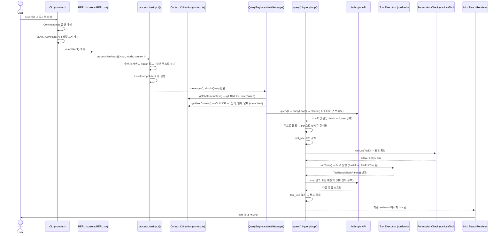

# 요청 생명주기 (Request Lifecycle)

## 개요

이 문서는 사용자가 프롬프트를 입력하는 순간부터 최종 응답이 터미널에 렌더링되기까지, 하나의 요청이 Claude Code 내부 파이프라인 전체를 통과하는 경로를 단계별로 추적한다. 각 단계에서 어떤 모듈이 개입하고, 어떤 데이터가 변환되며, 어떤 조건 분기가 발생하는지를 소스 코드에 기반하여 정확하게 서술한다.

---

## 전체 흐름 다이어그램



---

## 단계 1: CLI 부트스트랩

**관련 파일:** `src/main.tsx`

Claude Code가 실행되면 `main.tsx`가 진입점 역할을 한다. 모듈 평가가 시작되는 즉시 세 가지 사이드 이펙트가 순차적으로 트리거되어, 이후 약 135ms의 무거운 모듈 임포트 시간 동안 백그라운드에서 I/O를 병렬로 수행한다.

```
profileCheckpoint('main_tsx_entry')   // 기동 프로파일링 마커
startMdmRawRead()                      // MDM 설정 읽기 (plutil/reg query 서브프로세스)
startKeychainPrefetch()                // macOS Keychain: OAuth 토큰 + 레거시 API 키 병렬 읽기
```

이 세 작업이 먼저 실행된 후 Commander.js가 CLI 옵션을 파싱한다. `--model`, `--tools`, `--add-dir`, `--print`, `--output-format` 등 수십 개의 옵션이 여기서 처리된다. 파싱이 완료되면 최종적으로 `launchRepl()`을 호출하여 인터랙티브 세션을 시작한다.

**병렬 프리페치 항목:**
- MDM(Mobile Device Management) 원격 관리 설정
- Keychain에서 OAuth 토큰 및 레거시 API 키
- GrowthBook A/B 테스트 플래그 초기화
- MCP(Model Context Protocol) 공식 레지스트리 URL 프리페치

---

## 단계 2: 사용자 입력 수신

**관련 파일:** `src/screens/REPL.tsx`, `src/utils/processUserInput/processUserInput.ts`

REPL은 Ink(React 기반 터미널 UI 라이브러리)로 렌더링된 `PromptInput` 컴포넌트를 통해 사용자 입력을 수신한다. 사용자가 Enter를 누르면 `handlePromptSubmit()`이 호출되고, 이것이 `processUserInput()`으로 이어진다.

`processUserInput()`은 원시 입력을 API 호출에 적합한 메시지 배열로 변환하는 게이트웨이다. 내부적으로 `processUserInputBase()`를 호출한 뒤 `UserPromptSubmit` 훅을 실행한다.

**입력 분기 처리:**

| 입력 유형 | 분기 경로 |
|---|---|
| `/` 로 시작하는 문자열 | `processSlashCommand()` — 슬래시 커맨드 처리 |
| `bash` 모드 | `processBashCommand()` — Bash 직접 실행 |
| 이미지 포함 (ContentBlockParam[]) | 이미지 리사이즈 및 base64 처리 후 일반 경로 |
| 일반 텍스트 | `processTextPrompt()` — UserMessage 생성 |

**슬래시 커맨드 탐지:**
입력이 `/`로 시작하고 `skipSlashCommands`가 false이면 슬래시 커맨드로 처리된다. `parseSlashCommand()`로 커맨드 이름을 파싱한 뒤 `findCommand()`로 등록된 커맨드를 탐색한다. 원격 브리지(CCR) 클라이언트에서 온 입력은 `bridgeOrigin` 플래그와 `isBridgeSafeCommand()` 검사를 통해 안전한 커맨드만 허용한다.

**반환값 (`ProcessUserInputBaseResult`):**
```typescript
{
  messages: (UserMessage | AssistantMessage | AttachmentMessage | SystemMessage)[],
  shouldQuery: boolean,   // false이면 LLM 호출 없이 즉시 반환
  allowedTools?: string[],
  model?: string,
  resultText?: string,
}
```

---

## 단계 3: 컨텍스트 수집

**관련 파일:** `src/context.ts`

`QueryEngine.submitMessage()`는 API 호출 전에 시스템 프롬프트를 구성하기 위해 두 가지 컨텍스트 수집 함수를 호출한다. 두 함수 모두 `lodash-es/memoize`로 메모이제이션되어 동일 대화 내에서는 한 번만 실행된다.

### `getSystemContext()`

Git 저장소 정보를 수집하여 시스템 프롬프트에 포함시킨다. `getGitStatus()`를 내부적으로 호출하며, 다음 git 명령들을 병렬로 실행한다:

```
git --no-optional-locks status --short   // 변경 파일 목록
git --no-optional-locks log --oneline -n 5  // 최근 커밋 5개
git config user.name                     // 사용자 이름
getBranch()                              // 현재 브랜치
getDefaultBranch()                       // 기본 브랜치 (PR 대상)
```

반환되는 컨텍스트 문자열 예시:
```
Current branch: main
Main branch (you will usually use this for PRs): main
Git user: Jane Smith
Status:
 M src/query.ts
Recent commits:
abc1234 Fix tool permission check
...
```

상태 문자열이 2,000자를 초과하면 잘라낸 뒤 BashTool 사용을 안내하는 메시지를 덧붙인다. 원격 CCR 환경(`CLAUDE_CODE_REMOTE` 환경변수) 또는 git 지시사항이 비활성화된 경우 이 단계를 건너뛴다.

### `getUserContext()`

사용자 정의 지시사항과 현재 날짜를 수집한다:

- **CLAUDE.md 탐색**: 작업 디렉터리에서 상위 방향으로 `CLAUDE.md` 파일을 탐색(`getMemoryFiles()` → `filterInjectedMemoryFiles()` → `getClaudeMds()`). `CLAUDE_CODE_DISABLE_CLAUDE_MDS` 환경변수 또는 `--bare` 모드에서 비활성화.
- **현재 날짜**: `getLocalISODate()`로 ISO 형식 날짜 생성 후 `"Today's date is YYYY-MM-DD."` 형태로 포함.

수집된 컨텍스트는 시스템 프롬프트의 일부로 `prependUserContext()` / `appendSystemContext()`를 통해 API 요청에 포함된다.

---

## 단계 4: LLM 호출 (QueryEngine → query())

**관련 파일:** `src/QueryEngine.ts`, `src/query.ts`

### QueryEngineConfig

`QueryEngine`은 하나의 대화 세션에 대응하는 클래스다. 생성자에서 받는 `QueryEngineConfig`의 핵심 필드:

```typescript
{
  cwd: string,              // 현재 작업 디렉터리
  tools: Tools,             // 사용 가능한 도구 목록
  commands: Command[],      // 슬래시 커맨드 목록
  mcpClients: MCPServerConnection[],  // MCP 서버 연결
  agents: AgentDefinition[],          // 에이전트 정의
  canUseTool: CanUseToolFn,           // 도구 권한 확인 함수
  getAppState: () => AppState,
  setAppState: (f) => void,
  maxTurns?: number,        // 최대 에이전트 루프 횟수
  maxBudgetUsd?: number,    // 예산 제한
}
```

### submitMessage() → query() 흐름

`submitMessage()`는 다음 순서로 동작한다:

1. `processUserInput()`으로 사용자 입력을 메시지 배열로 변환
2. `fetchSystemPromptParts()`로 시스템 프롬프트 조립 (기본 프롬프트 + 사용자 컨텍스트 + 시스템 컨텍스트)
3. 세션 트랜스크립트 기록 (`recordTranscript()`) — API 응답 전에 선제적으로 저장
4. `query()` 호출 — 실제 LLM 통신 루프 시작

`query()`는 `queryLoop()`에 위임하는 얇은 래퍼이며, 완료된 커맨드 UUID를 lifecycle 이벤트로 통지하는 역할만 추가한다.

### queryLoop() 내부

`queryLoop()`는 비동기 제너레이터(`AsyncGenerator`)로 구현된 핵심 에이전트 루프다. 각 이터레이션에서:

1. `normalizeMessagesForAPI()`로 메시지를 Anthropic API 형식으로 정규화
2. `claude()` 함수를 통해 스트리밍 API 호출
3. 스트림에서 수신되는 이벤트를 즉시 `yield`하여 렌더러에 전달

**스트리밍 응답 처리:**
- `text_delta` 이벤트 → 텍스트 청크를 누적하여 Ink 컴포넌트에 실시간 전달
- `tool_use` 블록 → 도구 실행 경로로 분기
- `message_stop` → 현재 이터레이션 종료, 루프 계속 여부 결정

**토큰 및 비용 추적:**
API 응답의 `usage` 필드를 `accumulateUsage()` / `updateUsage()`로 집계한다. `getTotalCost()`, `getModelUsage()`, `getTotalAPIDuration()`을 통해 누적 비용과 지연 시간을 추적한다.

---

## 단계 5: Tool 실행

**관련 파일:** `src/query.ts`, `src/services/tools/toolOrchestration.ts`, `src/Tool.ts`

LLM 응답에 `tool_use` 블록이 포함되면 도구 실행 경로로 진입한다.

### 권한 확인 (ToolPermissionContext)

도구 실행 전에 `canUseTool()`이 호출된다. `ToolPermissionContext`는 다음 필드로 권한 정책을 관리한다:

```typescript
type ToolPermissionContext = {
  mode: PermissionMode,  // 'default' | 'acceptEdits' | 'bypassPermissions' | 'plan'
  alwaysAllowRules: ToolPermissionRulesBySource,
  alwaysDenyRules: ToolPermissionRulesBySource,
  alwaysAskRules: ToolPermissionRulesBySource,
  isBypassPermissionsModeAvailable: boolean,
  shouldAvoidPermissionPrompts?: boolean,  // 백그라운드 에이전트에서 true
}
```

`canUseTool()`의 반환값은 `{ behavior: 'allow' | 'deny' | 'ask' }`이며, `deny`나 `ask`(사용자가 거부)인 경우 `SDKPermissionDenial`로 기록된다.

### 입력 스키마 검증

각 도구는 Zod 스키마(`inputSchema`)를 보유한다. 도구 실행 전에 LLM이 제공한 `tool_input`을 해당 스키마로 검증한다. 검증 실패 시 오류를 `tool_result` 블록으로 래핑하여 LLM에게 다시 전달한다.

### 도구 실행 (runTools)

`runTools()`는 `StreamingToolExecutor`를 통해 허가된 도구들을 실행한다. 실행 결과는 `ToolResultBlockParam[]`으로 수집된다.

**기본 제공 도구 목록 (`src/tools.ts`):**

| 도구 | 역할 |
|---|---|
| `BashTool` | 셸 커맨드 실행 |
| `FileReadTool` | 파일 읽기 |
| `FileEditTool` | 파일 편집 (diff 기반) |
| `FileWriteTool` | 파일 쓰기 |
| `GlobTool` | 파일 패턴 검색 |
| `GrepTool` | 내용 패턴 검색 |
| `WebFetchTool` | URL 콘텐츠 가져오기 |
| `WebSearchTool` | 웹 검색 |
| `AgentTool` | 서브에이전트 실행 |
| `TodoWriteTool` | TODO 목록 관리 |
| `SkillTool` | 슬래시 커맨드 스킬 실행 |
| `NotebookEditTool` | Jupyter 노트북 편집 |

MCP 도구는 `mcpClients`를 통해 동적으로 추가된다.

---

## 단계 6: 에이전트 루프

**관련 파일:** `src/query.ts` (`queryLoop()`), `src/QueryEngine.ts` (`submitMessage()`), `src/utils/fileHistory.ts`

도구 실행 결과가 있으면 `queryLoop()`는 루프를 계속한다. 결과를 새로운 `UserMessage`의 `tool_result` 블록으로 추가하고 LLM에게 재질의한다.

### 루프 종료 조건

| 조건 | 처리 |
|---|---|
| 응답에 tool_use 블록 없음 | 정상 종료 (`Terminal` 반환) |
| `maxTurns` 도달 | 강제 종료, 결과 메시지 반환 |
| `maxBudgetUsd` 초과 | 비용 초과 오류 반환 |
| 사용자 중단 (Ctrl+C) | `AbortController.abort()` 신호 전파 |
| LLM이 `stop_reason: "end_turn"` 반환 | 정상 종료 |

### 파일 히스토리 스냅샷

`fileHistoryEnabled()` 조건이 만족되면 사용자 메시지마다 `fileHistoryMakeSnapshot()`을 호출하여 파일 상태 스냅샷을 기록한다. 이 스냅샷은 `/undo` 커맨드가 이전 상태로 복원할 때 사용된다.

### 컨텍스트 압축 (Auto-compact)

`calculateTokenWarningState()`로 토큰 사용량을 모니터링하며, 컨텍스트가 한계에 가까워지면 `autoCompact` 메커니즘이 활성화된다. `buildPostCompactMessages()`로 대화 히스토리를 압축하고 `compact_boundary` 시스템 메시지를 삽입한다.

---

## 단계 7: 응답 렌더링

**관련 파일:** `src/screens/REPL.tsx`, Ink React 컴포넌트들

`query()`에서 `yield`된 메시지들은 Ink의 React 렌더링 파이프라인을 통해 터미널에 출력된다.

**스트리밍 렌더링:**
`text_delta` 이벤트가 도착할 때마다 Ink 컴포넌트가 리렌더링되어 타이핑 효과처럼 텍스트가 점진적으로 표시된다. 마크다운 구문은 터미널 색상과 굵기로 변환된다.

**도구 결과 인라인 표시:**
도구 실행 중에는 스피너와 함께 진행 상황이 표시된다. 실행 완료 후에는 결과(파일 변경 내용, 커맨드 출력 등)가 접을 수 있는 블록으로 렌더링된다.

**비용 및 토큰 정보:**
각 응답 완료 후 `getTotalCost()`, `getModelUsage()`를 통해 집계된 토큰 사용량과 비용이 표시된다.

**최종 `result` 메시지 (SDK 모드):**
SDK(`QueryEngine`) 경로에서는 모든 처리 완료 후 다음 형식의 최종 결과 메시지를 `yield`한다:

```typescript
{
  type: 'result',
  subtype: 'success',
  duration_ms: number,
  duration_api_ms: number,
  num_turns: number,
  result: string,           // 최종 텍스트 응답
  total_cost_usd: number,
  usage: NonNullableUsage,
  permission_denials: SDKPermissionDenial[],
}
```

---

## 각 단계별 Level 2 참조 링크

| 단계 | 주제 | Level 2 문서 |
|---|---|---|
| 단계 1 | CLI 부트스트랩 및 기동 시퀀스 | [CLI 부트스트랩 상세](../level-2-systems/query-engine.md) |
| 단계 2 | 입력 처리 및 슬래시 커맨드 | [입력 처리 상세](../level-2-systems/command-system.md) |
| 단계 3 | 컨텍스트 수집 및 시스템 프롬프트 | [컨텍스트 수집 상세](../level-3-internals/context-compression.md) |
| 단계 4 | QueryEngine 및 LLM 통신 | [QueryEngine 상세](../level-2-systems/query-engine.md) |
| 단계 5 | 도구 권한 및 실행 | [Tool 실행 상세](../level-2-systems/tool-system.md) |
| 단계 6 | 에이전트 루프 제어 | [에이전트 루프 상세](../level-2-systems/agent-coordinator.md) |
| 단계 7 | Ink 렌더링 파이프라인 | [렌더링 상세](../level-2-systems/ui-ink-components.md) |

---

## Navigation

- 이전: [아키텍처 개요](architecture.md)
- 다음: [핵심 개념](key-concepts.md)
- 상위: [목차](../README.md)
