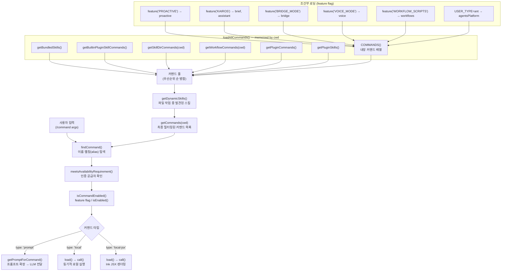

# 커맨드 시스템: 슬래시 커맨드 분석

## 1. 개요

커맨드 시스템은 사용자가 `/commit`, `/mcp`, `/review` 처럼 슬래시(`/`)로 시작하는 명령어를 입력할 때 이를 해석하고 실행하는 계층이다. 단순한 UI 단축키가 아니라 Claude Code의 모든 사용자 대면 기능을 조율하는 중앙 디스패처 역할을 수행한다.

**역할 요약:**
- **등록**: 내장(built-in) 커맨드, 스킬(skill) 디렉터리, 플러그인, MCP 서버, 워크플로 스크립트를 단일 커맨드 풀로 통합
- **필터링**: 인증 공급자 가용성(availability), feature flag(`bun:bundle`의 `feature()`), 환경 변수 조건을 거쳐 현재 세션에서 사용 가능한 커맨드 목록을 결정
- **실행**: 커맨드 타입(`prompt` / `local` / `local-jsx`)에 따라 서로 다른 실행 경로로 위임
- **캐시 관리**: `lodash-es/memoize`를 사용하여 디스크 I/O가 수반되는 동적 로딩을 메모이제이션

**핵심 파일:**

| 파일 | 역할 |
|------|------|
| `src/commands.ts` | 레지스트리, 필터링, 공개 API 전체 |
| `src/types/command.ts` | `Command` 타입 계층 정의 |
| `src/commands/*/index.ts` | 개별 커맨드 구현체 (100개 이상) |

---

## 2. 아키텍처 다이어그램



---

## 3. Command 타입 분석

`src/types/command.ts`에 정의된 타입 계층은 모든 커맨드가 공유하는 `CommandBase`와 실행 방식을 결정하는 세 가지 유니언 멤버로 구성된다.

### 3.1 CommandBase — 공통 메타데이터

```typescript
type CommandBase = {
  name: string                          // 슬래시 뒤에 오는 식별자 (/name)
  description: string                   // 자동완성·도움말에 표시되는 설명
  aliases?: string[]                    // 대체 이름 (예: config의 'settings')
  availability?: CommandAvailability[]  // 'claude-ai' | 'console' (인증 게이팅)
  isEnabled?: () => boolean             // feature flag / 환경 조건
  isHidden?: boolean                    // 자동완성 목록에서 숨김
  argumentHint?: string                 // 인수 힌트 (회색 미리보기 텍스트)
  whenToUse?: string                    // 모델 호출 시나리오 설명 (스킬 전용)
  disableModelInvocation?: boolean      // 모델이 직접 호출하지 못하도록 차단
  loadedFrom?: 'commands_DEPRECATED' | 'skills' | 'plugin' | 'managed' | 'bundled' | 'mcp'
  source: SettingSource | 'builtin' | 'mcp' | 'plugin' | 'bundled'
  kind?: 'workflow'                     // 워크플로 배지 표시
  immediate?: boolean                   // 큐를 우회하여 즉시 실행
  isSensitive?: boolean                 // 인수를 대화 히스토리에서 삭제
}
```

### 3.2 세 가지 실행 타입

| 타입 | 설명 | 실행 방식 | 대표 예시 |
|------|------|-----------|-----------|
| `prompt` | 프롬프트 템플릿을 LLM에 전달 | `getPromptForCommand()` → ContentBlockParam[] → 모델 쿼리 | `/commit`, `/review`, `/security-review` |
| `local` | 순수 로컬 함수 실행 | `load()` → `call()` → `LocalCommandResult` | `/compact`, `/cost`, `/clear` |
| `local-jsx` | Ink 기반 인터랙티브 UI 렌더링 | `load()` → `call()` → `React.ReactNode` | `/mcp`, `/config`, `/session`, `/plan` |

#### PromptCommand 추가 필드

```typescript
type PromptCommand = {
  progressMessage: string        // 실행 중 표시할 메시지
  contentLength: number          // 토큰 추정용 콘텐츠 길이 (동적이면 0)
  allowedTools?: string[]        // 이 커맨드 실행 중 허용되는 도구 목록
  model?: string                 // 특정 모델 지정 (없으면 세션 기본값 사용)
  context?: 'inline' | 'fork'   // 'fork': 별도 서브에이전트로 실행
  agent?: string                 // fork 컨텍스트에서 사용할 에이전트 타입
  paths?: string[]               // 이 glob 패턴에 해당하는 파일 접근 후에만 표시
  hooks?: HooksSettings          // 스킬 호출 시 등록할 훅
}
```

#### LocalCommand 추가 필드

```typescript
type LocalCommand = {
  supportsNonInteractive: boolean  // CI/비대화형 모드 지원 여부
  load: () => Promise<LocalCommandModule>
}
```

#### LocalJSXCommand 추가 필드

```typescript
type LocalJSXCommand = {
  load: () => Promise<LocalJSXCommandModule>
  // load()는 항상 지연 임포트(dynamic import)로 구현
  // → 무거운 UI 의존성을 커맨드 호출 시점까지 번들에서 분리
}
```

---

## 4. 커맨드 레지스트리

### 4.1 직접 import (정적 로딩)

`commands.ts` 상단에서 약 55개 커맨드를 ES 모듈 정적 임포트로 등록한다. 이 커맨드들은 번들 시점에 포함되며 런타임 조건 없이 항상 사용 가능하다.

```typescript
import commit from './commands/commit.js'
import compact from './commands/compact/index.js'
import mcp from './commands/mcp/index.js'
// ... (약 55개)
```

각 커맨드 파일(예: `src/commands/mcp/index.ts`)은 커맨드 객체를 정의하고 무거운 구현체는 `load: () => import('./mcp.js')` 형태로 지연 임포트한다. 결과적으로 **메타데이터는 즉시**, **실제 로직은 필요 시** 로드된다.

### 4.2 조건부 require (feature flag 게이팅)

Bun 번들러의 `feature()` 함수와 CommonJS `require()`를 조합하여 특정 기능이 활성화된 경우에만 커맨드를 포함시킨다. `feature()`는 빌드 시 데드 코드 제거(dead code elimination)를 가능하게 한다.

```typescript
// 단일 플래그
const voiceCommand = feature('VOICE_MODE')
  ? require('./commands/voice/index.js').default
  : null

// 복합 플래그 (OR)
const proactive = feature('PROACTIVE') || feature('KAIROS')
  ? require('./commands/proactive.js').default
  : null

// 복합 플래그 (AND)
const remoteControlServerCommand =
  feature('DAEMON') && feature('BRIDGE_MODE')
    ? require('./commands/remoteControlServer/index.js').default
    : null
```

null이 된 커맨드는 스프레드 연산자(`...(voiceCommand ? [voiceCommand] : [])`)로 `COMMANDS()` 배열에서 자동 제외된다.

### 4.3 사용자 타입 게이팅

`USER_TYPE === 'ant'`인 경우에만 `INTERNAL_ONLY_COMMANDS`가 `COMMANDS()`에 포함된다. 이 배열에는 `backfillSessions`, `bughunter`, `commit`, `goodClaude`, `autofixPr` 등 Anthropic 내부 개발자 전용 커맨드 약 20개가 포함된다.

```typescript
...(process.env.USER_TYPE === 'ant' && !process.env.IS_DEMO
  ? INTERNAL_ONLY_COMMANDS
  : []),
```

### 4.4 가용성(Availability) 게이팅

`CommandAvailability` 타입으로 인증 공급자별 접근을 제한한다.

| 값 | 대상 |
|----|------|
| `'claude-ai'` | claude.ai OAuth 구독자 (Pro/Max/Team/Enterprise) |
| `'console'` | Anthropic Console API 키 사용자 (api.anthropic.com 직접 접근) |

`meetsAvailabilityRequirement()`는 매 `getCommands()` 호출 시 재평가된다(메모이제이션 없음). `/login` 이후 인증 상태가 변경되어도 즉시 반영된다.

### 4.5 동적 로딩 소스 우선순위

`loadAllCommands()`는 다음 순서로 커맨드를 병합한다:

```
bundledSkills → builtinPluginSkills → skillDirCommands
  → workflowCommands → pluginCommands → pluginSkills → COMMANDS()
```

나중에 추가된 커맨드가 이름 충돌 시 덮어쓰지 않도록 중복 제거는 `getCommands()`의 Set 기반 필터링으로 처리된다.

### 4.6 지연 로딩 특례: /insights

113KB에 달하는 `insights.ts` 모듈은 정적 임포트 없이 `commands.ts` 내부에서 직접 인라인 `prompt` 타입 커맨드로 정의되어 있다.

```typescript
const usageReport: Command = {
  type: 'prompt',
  name: 'insights',
  // ...
  async getPromptForCommand(args, context) {
    const real = (await import('./commands/insights.js')).default
    return real.getPromptForCommand(args, context)
  },
}
```

이 패턴은 `getPromptForCommand()` 호출 시점에만 무거운 모듈을 로드하는 지연 심(lazy shim)이다.

---

## 5. 커맨드 실행 흐름

### 5.1 커맨드 탐색

```typescript
function findCommand(commandName: string, commands: Command[]): Command | undefined {
  return commands.find(
    _ =>
      _.name === commandName ||
      getCommandName(_) === commandName ||  // userFacingName() 우선
      _.aliases?.includes(commandName),
  )
}
```

`getCommandName()`은 `cmd.userFacingName?.()`을 먼저 시도하여 플러그인이 접두사를 제거한 이름을 표시할 수 있도록 한다. 탐색 실패 시 `getCommand()`가 사용 가능한 모든 커맨드 이름을 나열한 `ReferenceError`를 던진다.

### 5.2 prompt 타입 실행 흐름

```
사용자 입력 /commit
  → findCommand('commit') → commit 커맨드 객체
  → getPromptForCommand(args, context) 호출
      → executeShellCommandsInPrompt() 로 !`git status` 등 셸 명령 미리 실행
      → ContentBlockParam[] 반환
  → 반환된 프롬프트가 현재 대화에 삽입되어 LLM에 전달
  → LLM이 allowedTools 범위 내에서 도구 호출 수행
```

`allowedTools` 필드는 해당 커맨드 실행 중에 사용 가능한 도구를 제한한다. `/commit`의 경우 `['Bash(git add:*)', 'Bash(git status:*)', 'Bash(git commit:*)']`로 git 관련 작업만 허용한다.

### 5.3 local 타입 실행 흐름

```
사용자 입력 /compact [instructions]
  → findCommand('compact') → compact 커맨드 객체
  → compact.load() → import('./compact.js') (지연 임포트)
  → module.call(args, context) 호출
  → LocalCommandResult 반환
      → { type: 'text', value: string }
      → { type: 'compact', compactionResult, displayText? }
      → { type: 'skip' }
```

`supportsNonInteractive: true`인 경우 `--print` 플래그 등 비대화형 모드에서도 실행 가능하다.

### 5.4 local-jsx 타입 실행 흐름

```
사용자 입력 /mcp enable server-name
  → findCommand('mcp') → mcp 커맨드 객체
  → immediate: true → 큐 대기 없이 즉시 실행
  → mcp.load() → import('./mcp.js') (지연 임포트)
  → module.call(onDone, context, args) 호출
  → React.ReactNode 반환 → Ink 렌더러가 터미널에 출력
  → 사용자 인터랙션 완료 후 onDone() 호출
      → display: 'skip' | 'system' | 'user'
      → shouldQuery: true → 완료 후 LLM에 메시지 전달
```

### 5.5 캐시 무효화

| 함수 | 용도 |
|------|------|
| `clearCommandMemoizationCaches()` | 커맨드 목록 캐시만 클리어 (스킬 캐시 유지) |
| `clearCommandsCache()` | 전체 캐시 클리어 (플러그인, 스킬 포함) |

동적 스킬이 추가되면 `clearCommandMemoizationCaches()`를 호출하여 `loadAllCommands`와 `getSkillToolCommands`의 memoize 캐시를 무효화한다. `skillSearch/localSearch.ts`의 스킬 인덱스는 별도 메모이제이션 계층이므로 `clearSkillIndexCache?.()` 호출이 추가로 필요하다.

---

## 6. 주요 커맨드 카테고리

### 6.1 Git / 코드 관리

| 커맨드 | 타입 | 설명 |
|--------|------|------|
| `/commit` | prompt | git add/status/commit을 LLM이 수행 |
| `/commit-push-pr` | prompt | commit + push + PR 생성 원스텝 |
| `/review` | prompt | `gh pr` 기반 PR 코드 리뷰 |
| `/ultrareview` | local-jsx | 원격 bughunter 경로를 통한 심층 리뷰 |
| `/security-review` | prompt | 보안 취약점 집중 리뷰 |
| `/diff` | local-jsx | 현재 변경 사항 시각화 |
| `/branch` | local-jsx | 브랜치 관리 |
| `/autofix-pr` | prompt | PR 자동 수정 (내부 전용) |

### 6.2 컨텍스트 / 메모리 관리

| 커맨드 | 타입 | 설명 |
|--------|------|------|
| `/compact` | local | 대화 히스토리 압축, 요약 보존 |
| `/context` | local-jsx | 컨텍스트 창 관리 |
| `/memory` | local-jsx | 프로젝트/사용자 메모리 편집 |
| `/clear` | local | 대화 초기화 |
| `/summary` | local | 대화 요약 생성 |
| `/rewind` | local-jsx | 이전 대화 상태로 복귀 |
| `/files` | local | 추적 중인 파일 목록 |

### 6.3 설정 / 환경

| 커맨드 | 타입 | 설명 |
|--------|------|------|
| `/config` (= `/settings`) | local-jsx | 설정 패널 열기 |
| `/model` | local-jsx | 사용 모델 변경 |
| `/theme` | local-jsx | 터미널 테마 변경 |
| `/vim` | local | Vim 모드 토글 |
| `/keybindings` | local-jsx | 키 바인딩 관리 |
| `/effort` | local-jsx | 모델 사고 노력(effort) 조정 |
| `/output-style` | local-jsx | 출력 스타일 변경 |
| `/sandbox-toggle` | local-jsx | 샌드박스 모드 토글 |
| `/env` | local-jsx | 환경 변수 관리 |
| `/remote-env` | local-jsx | 원격 환경 변수 관리 |

### 6.4 MCP / 플러그인 / 스킬

| 커맨드 | 타입 | 설명 |
|--------|------|------|
| `/mcp` | local-jsx | MCP 서버 활성화/비활성화 |
| `/plugin` | local-jsx | 플러그인 관리 |
| `/reload-plugins` | local | 플러그인 캐시 재로드 |
| `/skills` | local-jsx | 사용 가능한 스킬 목록 조회 |
| `/hooks` | local-jsx | 훅 설정 관리 |
| `/permissions` | local-jsx | 도구 권한 관리 |

### 6.5 세션 / 이력 관리

| 커맨드 | 타입 | 설명 |
|--------|------|------|
| `/session` (= `/remote`) | local-jsx | 원격 세션 URL/QR 코드 표시 |
| `/resume` | local-jsx | 이전 세션 재개 |
| `/tasks` | local-jsx | 백그라운드 태스크 관리 |
| `/agents` | local-jsx | 에이전트 목록 조회 |
| `/export` | local-jsx | 대화 내보내기 |
| `/tag` | local-jsx | 세션 태그 관리 |

### 6.6 AI 기능

| 커맨드 | 타입 | 설명 |
|--------|------|------|
| `/plan` | local-jsx | 플랜 모드 활성화/세션 플랜 조회 |
| `/thinkback` | local-jsx | 사고 과정 재검토 |
| `/thinkback-play` | local-jsx | 사고 재생 |
| `/fast` | local-jsx | 빠른 응답 모드 |
| `/passes` | local-jsx | 멀티 패스 실행 설정 |
| `/advisor` | prompt | 코드 개선 조언 |
| `/bughunter` | local-jsx | 버그 탐색 (내부 전용) |

### 6.7 설치 / 셋업

| 커맨드 | 타입 | 설명 |
|--------|------|------|
| `/init` | prompt | 프로젝트 CLAUDE.md 초기화 |
| `/doctor` | local-jsx | 설치 상태 진단 |
| `/ide` | local-jsx | IDE 익스텐션 설치 |
| `/terminal-setup` | local-jsx | 터미널 환경 설정 |
| `/install-github-app` | local-jsx | GitHub 앱 설치 |
| `/install-slack-app` | local-jsx | Slack 앱 설치 |
| `/upgrade` | local-jsx | Claude Code 업그레이드 |
| `/desktop` | local-jsx | 데스크탑 앱 설정 |
| `/mobile` | local-jsx | 모바일 QR 코드 |
| `/chrome` | local-jsx | Chrome 익스텐션 설정 |

### 6.8 인증 / 요금

| 커맨드 | 타입 | 설명 |
|--------|------|------|
| `/login` | local-jsx | 인증 (3P 서비스 비사용 시만 표시) |
| `/logout` | local | 로그아웃 |
| `/cost` | local | 세션 비용 조회 |
| `/usage` | local-jsx | 사용량 정보 |
| `/extra-usage` | local-jsx | 추가 사용량 구매 |
| `/rate-limit-options` | local-jsx | 요금 한도 설정 |
| `/insights` | prompt | 세션 분석 리포트 (지연 로드) |

### 6.9 유틸리티 / 기타

| 커맨드 | 타입 | 설명 |
|--------|------|------|
| `/help` | local-jsx | 도움말 |
| `/exit` | local | 종료 |
| `/status` | local-jsx | 시스템 상태 |
| `/statusline` | local | 상태 표시줄 토글 |
| `/copy` | local | 마지막 메시지 복사 |
| `/feedback` | local-jsx | 피드백 전송 |
| `/color` | local-jsx | 에이전트 색상 변경 |
| `/stickers` | local-jsx | 스티커 |
| `/btw` | local-jsx | 빠른 노트 |
| `/rename` | local-jsx | 세션 이름 변경 |
| `/stats` | local-jsx | 통계 조회 |
| `/release-notes` | local-jsx | 변경 이력 |
| `/privacy-settings` | local-jsx | 개인정보 설정 |
| `/add-dir` | local-jsx | 작업 디렉터리 추가 |

---

## 7. 주요 설계 결정

### 7.1 타입 유니언 방식의 실행 다형성

커맨드 실행은 상속 계층이 아닌 구조적 타입 유니언(`prompt | local | local-jsx`)으로 구현된다. 각 타입은 서로 다른 함수 시그니처(`getPromptForCommand` / `call`)를 가지며, 호출 측에서 `cmd.type` 판별식으로 분기한다. 이 방식은 타입 안전성을 유지하면서도 새로운 실행 타입을 추가할 때 기존 커맨드를 수정하지 않아도 된다는 장점이 있다.

### 7.2 메모이제이션과 신선도의 균형

`loadAllCommands(cwd)`는 `lodash-es/memoize`로 메모이제이션되어 디스크 I/O 비용을 절감한다. 반면 `meetsAvailabilityRequirement()`는 의도적으로 메모이제이션하지 않아 `/login` 이후 인증 상태 변경이 즉시 반영된다. 캐시 계층(memoize) 위에 신선한 필터링 계층을 두는 이중 구조가 핵심이다.

### 7.3 bun:bundle feature()를 활용한 데드 코드 제거

`feature('VOICE_MODE')` 같은 호출은 Bun 번들러가 빌드 시 평가하여 비활성 브랜치를 번들에서 완전히 제거한다. 외부 배포본에서 `INTERNAL_ONLY_COMMANDS`에 해당하는 코드가 포함되지 않는 것도 같은 원리다. `/* eslint-disable @typescript-eslint/no-require-imports */` 주석과 함께 CommonJS `require()`를 사용하는 이유가 여기에 있다: ES 모듈 정적 임포트는 번들러가 조건부 제거를 적용할 수 없기 때문이다.

### 7.4 원격 모드와 브리지 모드의 이중 안전 목록

`REMOTE_SAFE_COMMANDS`(18개)와 `BRIDGE_SAFE_COMMANDS`(6개)는 두 가지 다른 원격 실행 컨텍스트를 각각 제어한다. `REMOTE_SAFE_COMMANDS`는 CCR 초기화 전 TUI 사전 필터링에 사용되고, `BRIDGE_SAFE_COMMANDS`는 iOS/웹 클라이언트에서 들어오는 슬래시 커맨드의 안전 실행에 사용된다. `local-jsx` 타입은 Ink UI를 렌더링하므로 브리지에서 원천 차단된다(`isBridgeSafeCommand()`).

### 7.5 스킬과 커맨드의 통합 레지스트리

스킬(skill)은 `type: 'prompt'`인 커맨드의 하위 집합으로, `loadedFrom` 필드(`'skills'`, `'bundled'`, `'plugin'`)와 `disableModelInvocation` 유무로 구분된다. `getSkillToolCommands()`는 모델이 직접 호출할 수 있는 커맨드를, `getSlashCommandToolSkills()`는 슬래시 커맨드 형태로 사용자가 호출하는 스킬을 필터링한다. 이 통합 구조 덕분에 동일한 커맨드 객체가 자동완성 UI와 모델 SkillTool 양쪽에서 재사용된다.

### 7.6 formatDescriptionWithSource()의 UI/모델 분리

커맨드 설명은 사용자 대면 UI(자동완성, 도움말)와 모델 대면 프롬프트(SkillTool)에서 다르게 표시된다. UI에서는 `formatDescriptionWithSource()`가 출처 주석(`(plugin)`, `(bundled)`, `(workflow)`)을 추가하여 사용자가 커맨드 출처를 인식할 수 있게 한다. 모델 프롬프트에서는 `cmd.description`을 직접 사용하여 불필요한 메타 정보 없이 깔끔한 설명을 전달한다.

---

## Navigation

- 이전: [Tool 시스템: 도구 레지스트리 & 실행 파이프라인](./tool-system.md)
- 다음: [권한 시스템: 도구 실행 승인 흐름](./permission-system.md)
- 상위: [Level 2 시스템 분석 목록](../README.md)
