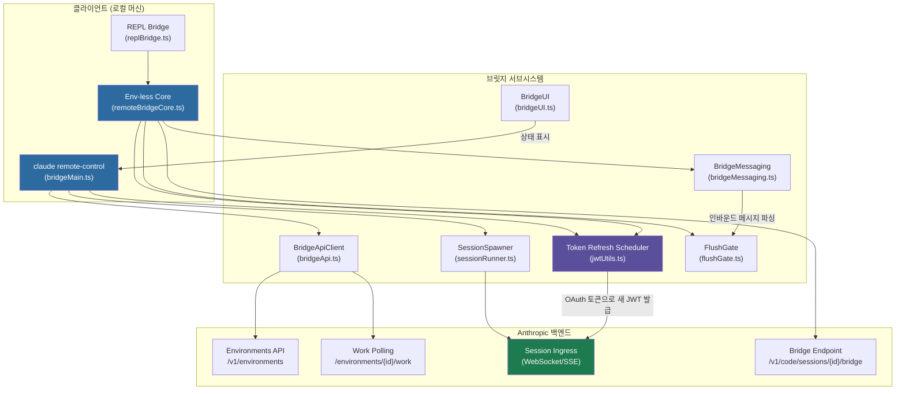
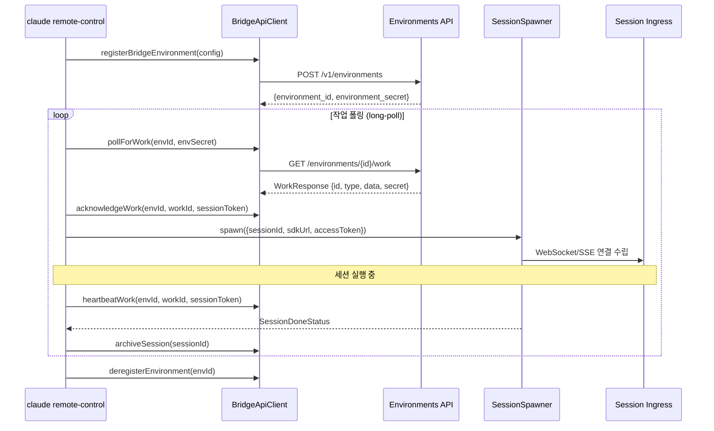

# IDE 브릿지 분석: VS Code/JetBrains 양방향 통신

> **레벨**: 내부 구현 (Level 3)
> **대상 독자**: Claude Code 핵심 기여자, 브릿지 프로토콜 확장 개발자
> **관련 소스**: `src/bridge/`

---

## 개요

Claude Code의 IDE 브릿지(Remote Control Bridge)는 로컬 개발 환경과 claude.ai 웹 클라이언트 사이의 양방향 통신 채널을 구현한다. 단순한 WebSocket 래퍼가 아니라, 환경 등록(Environment Registration), 작업 폴링(Work Polling), 세션 수명주기 관리, JWT 기반 토큰 갱신을 통합한 완결된 원격 제어 프레임워크다.

브릿지는 두 가지 아키텍처 경로를 지원한다:

- **환경 기반 경로(Env-based, `bridgeMain.ts`)**: Environments API 레이어를 통해 작업을 디스패치하는 고전적 방식. `claude remote-control` 명령이 이 경로를 사용한다.
- **환경 비의존 경로(Env-less, `remoteBridgeCore.ts`)**: `/v1/code/sessions/{id}/bridge` 엔드포인트를 통해 직접 세션 인그레스에 연결하는 신형 경로. REPL 전용이며 `tengu_bridge_repl_v2` GrowthBook 플래그로 활성화된다.

---

## 아키텍처 다이어그램



### 환경 기반 경로 상세 시퀀스



---

## 핵심 구현 분석

### 1. 환경 등록 및 작업 디스패치 (`bridgeMain.ts`)

브릿지 초기화는 `initBridgeCore()`에서 시작된다. 이 함수는 `BridgeConfig` 구조체를 받아 전체 폴링 루프를 구동한다.

```typescript
// types.ts - BridgeConfig 핵심 필드
export type BridgeConfig = {
  dir: string             // 작업 디렉토리
  machineName: string     // 환경 표시명
  bridgeId: string        // 클라이언트 생성 UUID (멱등성)
  environmentId: string   // 환경 등록용 UUID
  reuseEnvironmentId?: string  // 재연결 시 백엔드 환경 ID
  spawnMode: SpawnMode    // 'single-session' | 'worktree' | 'same-dir'
  workerType: string      // 'claude_code' | 'claude_code_assistant'
  sessionTimeoutMs?: number    // 기본값: 24시간
}
```

`SpawnMode`는 다중 세션 처리 전략을 결정한다. `worktree` 모드에서는 각 세션마다 독립된 git worktree를 생성하여 병렬 세션 간 파일 충돌을 방지한다.

### 2. JWT 토큰 갱신 스케줄러 (`jwtUtils.ts`)

세션 토큰의 선제적(proactive) 갱신은 `createTokenRefreshScheduler()`가 담당한다. 만료 5분 전에 갱신을 시도하는 버퍼 기반 설계다.

```typescript
const TOKEN_REFRESH_BUFFER_MS = 5 * 60 * 1000      // 만료 5분 전 갱신
const FALLBACK_REFRESH_INTERVAL_MS = 30 * 60 * 1000 // JWT 불투명 시 30분 주기
const MAX_REFRESH_FAILURES = 3                        // 연속 실패 서킷 브레이커
```

**세대(generation) 카운터 패턴**: 비동기 갱신 경쟁 조건을 방지하기 위해 세션별 세대 카운터를 사용한다. `schedule()` 또는 `cancel()` 호출 시 세대가 증가하며, 진행 중인 `doRefresh()`는 세대 불일치를 감지하면 즉시 중단한다.

```typescript
// 세대 불일치 감지 - 갱신 경쟁 방지
if (generations.get(sessionId) !== gen) {
  logForDebugging(`stale gen ${gen} vs ${generations.get(sessionId)}, skipping`)
  return
}
```

**두 가지 스케줄링 방식**:
- `schedule(sessionId, token)`: JWT `exp` 클레임을 디코딩하여 정확한 타이머 설정
- `scheduleFromExpiresIn(sessionId, expiresInSeconds)`: 서버가 `expires_in`을 직접 반환할 때 사용. `/v1/code/sessions/{id}/bridge` 응답이 이 방식을 사용

갱신 성공 후에는 `FALLBACK_REFRESH_INTERVAL_MS` 뒤에 후속 갱신을 예약하여, 장기 세션에서 인증이 끊기지 않도록 보장한다.

### 3. 환경 비의존 브릿지 코어 (`remoteBridgeCore.ts`)

신형 REPL 브릿지는 Environments API 레이어를 완전히 우회한다. 연결 수립 순서:

```
1. POST /v1/code/sessions              (OAuth 인증)         → session.id
2. POST /v1/code/sessions/{id}/bridge  (OAuth 인증)         → {worker_jwt, expires_in, api_base_url, worker_epoch}
3. createV2ReplTransport(worker_jwt, worker_epoch)           → SSE + CCRClient
4. createTokenRefreshScheduler                               → /bridge 재호출로 선제적 JWT 갱신
5. 401 발생 시 → 새 /bridge 자격증명으로 트랜스포트 재구성
```

`/bridge` 엔드포인트 호출 자체가 worker 등록 역할을 겸한다. 호출마다 epoch가 증가하므로 별도의 `/worker/register` 단계가 불필요하다.

세 가지 재연결 원인(`ConnectCause`)이 구분된다:
- `initial`: 초기 연결
- `proactive_refresh`: 토큰 만료 전 선제적 재연결
- `auth_401_recovery`: 401 응답 후 복구

### 4. 메시지 프로토콜 (`bridgeMessaging.ts`)

`handleIngressMessage()`와 `handleServerControlRequest()`가 양방향 메시지 처리를 담당한다. `BoundedUUIDSet`은 중복 메시지 처리 방지를 위한 링 버퍼 기반 UUID 집합이다.

```typescript
// 메시지 적격성 검사 - 브릿지가 처리할 메시지 필터링
export function isEligibleBridgeMessage(message: unknown): boolean
// 서버 제어 요청 처리 (권한 결정 등)
export function handleServerControlRequest(request: SDKControlRequest): SDKControlResponse
// 세션 제목 추출 (최초 사용자 메시지 기반)
export function extractTitleText(messages: Message[]): string | null
```

`FlushGate`는 메시지 플러싱을 제어하는 게이트 메커니즘으로, 세션 초기화 완료 전 조기 메시지 전송을 차단한다.

### 5. WorkSecret 디코딩 (`workSecret.ts`)

폴링으로 수신한 `WorkResponse`의 `secret` 필드는 base64url 인코딩된 JSON이다.

```typescript
export type WorkSecret = {
  version: number
  session_ingress_token: string  // 세션 인그레스 JWT
  api_base_url: string
  sources: Array<{ type: string; git_info?: {...} }>
  auth: Array<{ type: string; token: string }>
  claude_code_args?: Record<string, string> | null
  mcp_config?: unknown | null
  environment_variables?: Record<string, string> | null
  use_code_sessions?: boolean    // CCR v2 선택자
}
```

`buildSdkUrl()` 및 `buildCCRv2SdkUrl()`은 이 시크릿에서 SDK URL을 구성한다.

### 6. 신뢰 디바이스 토큰 (`trustedDevice.ts`)

`getTrustedDeviceToken()`은 디바이스 식별을 위한 신뢰 토큰을 반환한다. 이 토큰은 환경 등록 요청에 포함되어 백엔드가 재연결 시 동일 디바이스임을 확인하는 데 사용된다.

---

## 설계 결정

### 백오프 전략

연결 실패 시 지수 백오프를 적용하되 두 개의 독립적 파라미터 집합을 사용한다:

```typescript
const DEFAULT_BACKOFF: BackoffConfig = {
  connInitialMs: 2_000,      // 연결 실패: 2초 시작
  connCapMs: 120_000,        // 최대 2분
  connGiveUpMs: 600_000,     // 10분 후 포기
  generalInitialMs: 500,     // 일반 오류: 500ms 시작
  generalCapMs: 30_000,      // 최대 30초
  generalGiveUpMs: 600_000,  // 10분 후 포기
}
```

연결 오류(네트워크 단절)와 일반 오류(API 오류)를 구분하여 서로 다른 백오프 파라미터를 적용한다. 이는 일시적인 네트워크 장애에서 더 공격적으로 재연결을 시도하면서, 서버 측 오류에서는 보수적으로 처리하기 위함이다.

### 다중 세션 GrowthBook 게이팅

다중 세션 생성 모드(`--spawn`, `--capacity`)는 `tengu_ccr_bridge_multi_session` GrowthBook 플래그로 제어된다. 캐시 미스 시에도 차단(blocking) 게이트 확인을 사용하여 내부 사용자가 불공정하게 기능을 거부당하지 않도록 보장한다.

### 멱등 환경 등록

`bridgeId`와 `environmentId`는 모두 클라이언트에서 생성한 UUID다. 브릿지가 재시작될 때 동일한 UUID를 사용하면 백엔드가 중복 환경 생성을 방지할 수 있다. `reuseEnvironmentId`는 `--session-id` 재개 시 백엔드 형식의 환경 ID를 재사용하기 위한 별도 필드다.

### 세션 활동 링 버퍼

`SessionHandle.activities`는 최근 약 10개의 활동을 추적하는 링 버퍼다. 이 설계는 메모리를 상한으로 제한하면서 UI 상태 표시(`bridgeUI.ts`)에 충분한 컨텍스트를 제공한다.

---

## 관련 파일 참조

| 파일 | 역할 |
|------|------|
| `src/bridge/bridgeMain.ts` | 환경 기반 브릿지 진입점, 메인 폴링 루프 |
| `src/bridge/remoteBridgeCore.ts` | 환경 비의존 REPL 브릿지 코어 |
| `src/bridge/jwtUtils.ts` | JWT 디코딩, 토큰 갱신 스케줄러 |
| `src/bridge/types.ts` | 핵심 타입 정의 (BridgeConfig, WorkSecret 등) |
| `src/bridge/bridgeMessaging.ts` | 인바운드/아웃바운드 메시지 처리 |
| `src/bridge/bridgeApi.ts` | Environments API 클라이언트 구현 |
| `src/bridge/sessionRunner.ts` | 세션 프로세스 스폰 및 관리 |
| `src/bridge/replBridgeTransport.ts` | CCR v2 SSE 트랜스포트 |
| `src/bridge/workSecret.ts` | WorkSecret 디코딩, SDK URL 빌더 |
| `src/bridge/trustedDevice.ts` | 신뢰 디바이스 토큰 |

---

## 탐색 링크

- [컨텍스트 압축 & 토큰 관리](./context-compression.md)
- [인증 흐름 분석 (OAuth 2.0)](./oauth-auth.md)
- [Level 2: 아키텍처 개요](../level-1-overview/architecture.md)
