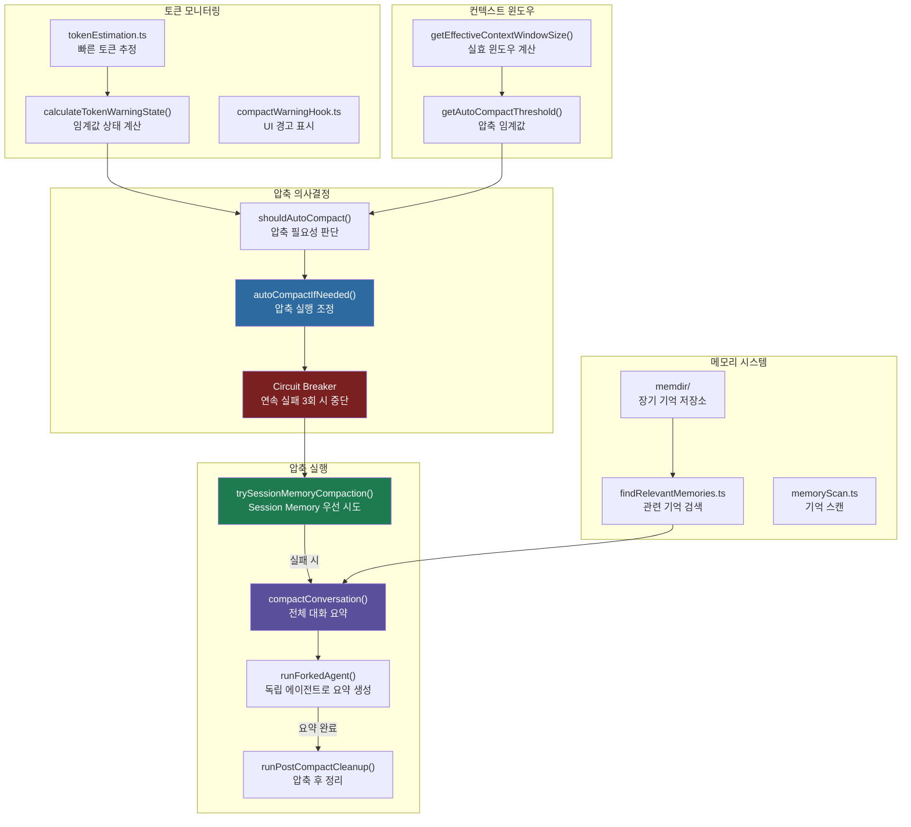
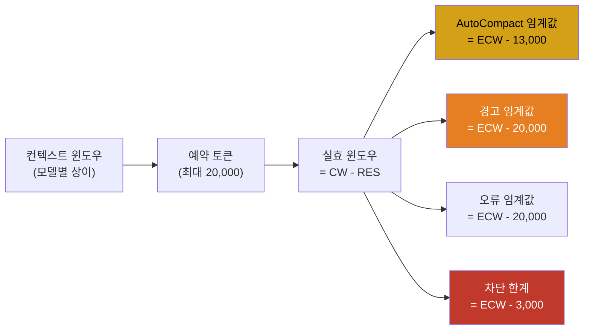
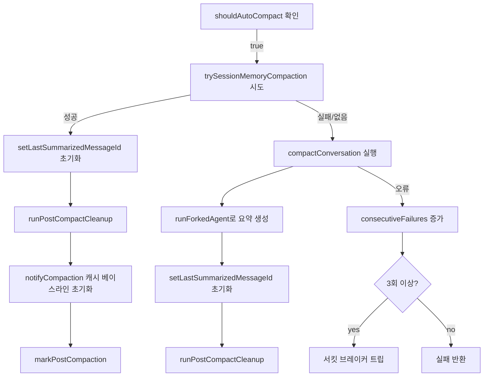

# 컨텍스트 압축 & 토큰 관리

> **레벨**: 내부 구현 (Level 3)
> **대상 독자**: Claude Code 핵심 기여자, 컨텍스트 관리 전략 연구자
> **관련 소스**: `src/services/compact/`, `src/services/tokenEstimation.ts`, `src/memdir/`, `src/context/`

---

## 개요

Claude Code의 컨텍스트 관리 시스템은 단일 메커니즘이 아니라 다중 계층으로 구성된 통합 전략이다. 대화가 길어질수록 토큰 사용량이 컨텍스트 윈도우 한계에 근접하며, 이를 처리하기 위해 다음 네 가지 서브시스템이 협력한다:

1. **토큰 추정 엔진** (`tokenEstimation.ts`): API 호출 없이 빠른 토큰 수 계산
2. **자동 압축(AutoCompact)** (`autoCompact.ts`): 임계값 초과 시 대화를 자동 요약
3. **대화 압축(Compact)** (`compact.ts`): 실제 요약 생성 및 메시지 교체
4. **메모리 디렉토리(Memdir)** (`memdir/`): 장기 기억을 파일 시스템에 영속화

세 가지 상호 배타적인 컨텍스트 관리 모드가 존재하며, GrowthBook 플래그를 통해 선택된다: 표준 AutoCompact, 리액티브 압축(`REACTIVE_COMPACT`), 컨텍스트 콜랩스(`CONTEXT_COLLAPSE`).

---

## 아키텍처 다이어그램



### 토큰 임계값 계층



---

## 핵심 구현 분석

### 1. 토큰 추정 엔진 (`tokenEstimation.ts`)

실제 API 토큰 카운팅은 네트워크 왕복 비용이 발생한다. `tokenEstimation.ts`는 로컬에서 빠르게 추정값을 계산하여 실시간 의사결정에 사용한다.

다중 API 공급자(Anthropic 직접, Bedrock, Vertex)를 지원하며, 각 공급자에 특화된 토큰 카운팅 로직이 구현되어 있다. Bedrock의 경우 `@aws-sdk/client-bedrock-runtime`을 동적으로 임포트하여 초기 번들 크기(약 279KB)를 절약한다.

**thinking 블록 처리**: 어시스턴트 메시지에 `thinking` 또는 `redacted_thinking` 블록이 포함된 경우 `hasThinkingBlocks()`가 이를 감지하여 토큰 카운팅 시 최소 예산(`TOKEN_COUNT_THINKING_BUDGET = 1024`)을 적용한다.

**tool search 필드 정제**: `stripToolSearchFieldsFromMessages()`는 tool search 베타에서만 유효한 `caller` 필드를 tool_use 블록에서 제거한다. API 오류를 방지하기 위해 토큰 카운팅 전에 메시지를 정제하는 방어적 설계다.

### 2. 실효 컨텍스트 윈도우 계산 (`autoCompact.ts`)

```typescript
// 출력 예약 토큰 상한: 20,000 (p99.99 압축 요약 크기)
const MAX_OUTPUT_TOKENS_FOR_SUMMARY = 20_000

export function getEffectiveContextWindowSize(model: string): number {
  const reservedTokensForSummary = Math.min(
    getMaxOutputTokensForModel(model),
    MAX_OUTPUT_TOKENS_FOR_SUMMARY,
  )
  let contextWindow = getContextWindowForModel(model, getSdkBetas())

  // 환경변수 오버라이드 (테스트용)
  const autoCompactWindow = process.env.CLAUDE_CODE_AUTO_COMPACT_WINDOW
  if (autoCompactWindow) {
    const parsed = parseInt(autoCompactWindow, 10)
    if (!isNaN(parsed) && parsed > 0) {
      contextWindow = Math.min(contextWindow, parsed)
    }
  }

  return contextWindow - reservedTokensForSummary
}
```

`MAX_OUTPUT_TOKENS_FOR_SUMMARY = 20,000`은 압축 요약 출력의 p99.99 관찰값(17,387 토큰)에서 도출된 경험적 수치다.

### 3. 임계값 상태 계산

다섯 가지 임계값 상태가 계산된다:

```typescript
export const AUTOCOMPACT_BUFFER_TOKENS = 13_000    // AutoCompact 발동 버퍼
export const WARNING_THRESHOLD_BUFFER_TOKENS = 20_000  // 경고 표시 버퍼
export const ERROR_THRESHOLD_BUFFER_TOKENS = 20_000    // 오류 표시 버퍼
export const MANUAL_COMPACT_BUFFER_TOKENS = 3_000      // 차단 한계 버퍼

// calculateTokenWarningState() 반환 타입
{
  percentLeft: number           // 잔여 비율 (0-100)
  isAboveWarningThreshold: boolean
  isAboveErrorThreshold: boolean
  isAboveAutoCompactThreshold: boolean
  isAtBlockingLimit: boolean    // 입력 차단 여부
}
```

`isAtBlockingLimit`이 `true`이면 새 사용자 입력이 거부된다. 이는 API `prompt_too_long` 오류가 발생하기 전에 시스템이 선제적으로 개입하는 최후 방어선이다.

### 4. 자동 압축 의사결정 (`shouldAutoCompact()`)

압축 실행 전 여러 가드 조건이 확인된다:

```typescript
// 재귀 방지: session_memory, compact 소스는 압축 불가
if (querySource === 'session_memory' || querySource === 'compact') return false

// marble_origami (컨텍스트 에이전트) 방지
if (feature('CONTEXT_COLLAPSE') && querySource === 'marble_origami') return false

// 리액티브 전용 모드: 선제적 AutoCompact 억제
if (feature('REACTIVE_COMPACT') && getFeatureValue_CACHED_MAY_BE_STALE('tengu_cobalt_raccoon', false)) return false

// 컨텍스트 콜랩스 모드: AutoCompact 억제 (콜랩스가 90%/95% 지점을 처리)
if (feature('CONTEXT_COLLAPSE') && isContextCollapseEnabled()) return false
```

`snipTokensFreed` 파라미터는 snip 작업으로 이미 회수된 토큰을 차감하여 이중 계산을 방지한다.

### 5. 서킷 브레이커 패턴

```typescript
const MAX_CONSECUTIVE_AUTOCOMPACT_FAILURES = 3

// 연속 실패 3회 후 해당 세션의 AutoCompact를 완전히 비활성화
if (tracking?.consecutiveFailures >= MAX_CONSECUTIVE_AUTOCOMPACT_FAILURES) {
  return { wasCompacted: false }
}
```

이 서킷 브레이커는 2026-03-10 BQ 분석 데이터에 기반한다: 단일 세션에서 50회 이상 연속 실패가 1,279개 세션에서 관찰되었으며 (최대 3,272회), 이로 인해 하루 약 250,000건의 불필요한 API 호출이 발생했다.

### 6. 압축 실행 순서 (`autoCompactIfNeeded()`)



Session Memory 압축이 우선 시도되는 이유: 세션 메모리는 메시지를 직접 정리하므로 비용이 낮다. 실패 시에만 전체 대화 요약(`compactConversation`)으로 폴백한다.

### 7. 대화 압축 구현 (`compact.ts`)

`compactConversation()`은 현재 대화를 독립 포크 에이전트(`runForkedAgent`)에게 전달하여 요약을 생성한다. 요약 생성에 사용되는 최대 출력 토큰은 `COMPACT_MAX_OUTPUT_TOKENS`로 제한된다.

주요 처리 단계:
1. `executePreCompactHooks()`: 압축 전 훅 실행
2. `analyzeContext()`: 현재 컨텍스트 분석 (통계 수집)
3. `runForkedAgent()`: 독립 에이전트로 요약 프롬프트 실행
4. `createCompactBoundaryMessage()`: 압축 경계 메시지 생성
5. `normalizeMessagesForAPI()`: API 전송용 메시지 정규화
6. `reAppendSessionMetadata()`: 세션 메타데이터 재추가
7. `executePostCompactHooks()`: 압축 후 훅 실행

`RecompactionInfo` 구조체는 연쇄 압축 추적에 사용된다:

```typescript
export type RecompactionInfo = {
  isRecompactionInChain: boolean     // 이전 압축 후 재압축 여부
  turnsSincePreviousCompact: number  // 이전 압축 이후 턴 수
  previousCompactTurnId?: string     // 이전 압축 턴 ID
  autoCompactThreshold: number       // 적용된 임계값
  querySource?: QuerySource          // 압축 유발 소스
}
```

### 8. 메모리 디렉토리 시스템 (`memdir/`)

`memdir`은 세션 간에 유지되는 장기 기억 저장소다. 파일 시스템 기반으로 구현되어 있으며, 기억은 유형별로 분류된다.

```typescript
// memoryTypes.ts
export const MEMORY_TYPE_VALUES = [
  'episodic',    // 특정 사건 기억
  'semantic',    // 지식/사실 기억
  'procedural',  // 절차/방법 기억
]
```

`findRelevantMemories.ts`는 현재 대화 컨텍스트와 관련된 기억을 검색하며, `memoryScan.ts`는 기억 디렉토리를 스캔하여 유효한 기억 항목을 필터링한다. `memoryAge.ts`는 기억의 노화(aging) 정책을 구현한다.

팀 메모리(`teamMemPaths.ts`, `teamMemPrompts.ts`)는 다중 에이전트 시나리오에서 에이전트 간 공유 기억을 관리한다.

### 9. 컨텍스트 윈도우 모달 컨텍스트 (`src/context/`)

`src/context/` 디렉토리는 UI 레이어의 React 컨텍스트를 포함한다. `mailbox.tsx`는 에이전트 간 메시지 큐를 관리하며, `stats.tsx`는 토큰 통계를 React 상태로 노출한다.

```typescript
// stats.tsx - 토큰 통계 컨텍스트
// modalContext.tsx - 모달 상태 관리
// QueuedMessageContext.tsx - 큐잉된 메시지 상태
// fpsMetrics.tsx - 렌더링 성능 메트릭
// voice.tsx - 음성 입력 컨텍스트
```

---

## 설계 결정

### 세 가지 압축 모드의 공존

AutoCompact, 리액티브 압축, 컨텍스트 콜랩스는 서로 배타적이며 GrowthBook 플래그로 제어된다. 이 설계는 프로덕션 환경에서 A/B 테스트를 가능하게 하면서 기능 플래그 없이 빌드에서는 불필요한 코드를 tree-shaking으로 제거할 수 있게 한다(`feature('CONTEXT_COLLAPSE')` 패턴).

컨텍스트 콜랩스 모드에서 AutoCompact가 억제되는 이유: 콜랩스의 90% 커밋 / 95% 차단 흐름이 실효 컨텍스트의 약 93%에 해당하는 AutoCompact 임계값(13,000 토큰 버퍼)과 겹치기 때문이다. 두 시스템이 동시에 활성화되면 경쟁 조건이 발생한다.

### 프롬프트 캐시 연속성 보장

압축 후 `notifyCompaction()`을 호출하여 프롬프트 캐시 베이스라인을 초기화한다. 이를 누락하면 압축 직후 캐시 읽기 드롭이 `systemPromptChanged=true`로 잘못 집계되어 `tengu_prompt_cache_break` 이벤트가 허위 양성으로 기록된다. 2026-03-01 BQ 분석에서 해당 이벤트의 20%가 허위 양성이었음이 확인되어 수정된 사항이다.

### Session Memory 압축 우선순위

`trySessionMemoryCompaction()`이 `compactConversation()`보다 먼저 시도되는 이유는 비용 효율성이다. 세션 메모리 압축은 중요한 메시지를 선택적으로 정리하므로 전체 요약 생성 API 호출을 회피할 수 있다. `setLastSummarizedMessageId(undefined)` 초기화는 두 경로 모두에서 수행되어, 이전 메시지 UUID가 새 메시지 배열에 존재하지 않는 상황에서 발생하는 참조 오류를 방지한다.

### 환경변수 오버라이드

다수의 임계값이 환경변수로 오버라이드 가능하다:
- `CLAUDE_CODE_AUTO_COMPACT_WINDOW`: 컨텍스트 윈도우 상한 설정
- `CLAUDE_AUTOCOMPACT_PCT_OVERRIDE`: 퍼센트 기반 임계값 설정 (0-100)
- `CLAUDE_CODE_BLOCKING_LIMIT_OVERRIDE`: 차단 한계 오버라이드
- `DISABLE_COMPACT`: 압축 전체 비활성화
- `DISABLE_AUTO_COMPACT`: 자동 압축만 비활성화 (수동 `/compact`는 유지)

---

## 관련 파일 참조

| 파일 | 역할 |
|------|------|
| `src/services/compact/autoCompact.ts` | AutoCompact 임계값, 의사결정, 서킷 브레이커 |
| `src/services/compact/compact.ts` | 대화 요약 생성 핵심 로직 |
| `src/services/compact/sessionMemoryCompact.ts` | Session Memory 기반 압축 |
| `src/services/compact/compactWarningHook.ts` | UI 경고 훅 |
| `src/services/compact/microCompact.ts` | 마이크로 압축 |
| `src/services/compact/prompt.ts` | 압축 프롬프트 템플릿 |
| `src/services/compact/postCompactCleanup.ts` | 압축 후 정리 |
| `src/services/tokenEstimation.ts` | 토큰 추정 엔진 (Anthropic/Bedrock/Vertex) |
| `src/memdir/memdir.ts` | 장기 기억 저장소 진입점 |
| `src/memdir/findRelevantMemories.ts` | 컨텍스트 기반 기억 검색 |
| `src/memdir/memoryScan.ts` | 기억 디렉토리 스캔 |
| `src/memdir/memoryTypes.ts` | 기억 유형 정의 |
| `src/context/stats.tsx` | 토큰 통계 React 컨텍스트 |
| `src/context/mailbox.tsx` | 에이전트 메시지 큐 |

---

## 탐색 링크

- [IDE 브릿지 분석](./bridge-ide.md)
- [인증 흐름 분석 (OAuth 2.0)](./oauth-auth.md)
- [Level 2: 아키텍처 개요](../level-1-overview/architecture.md)
