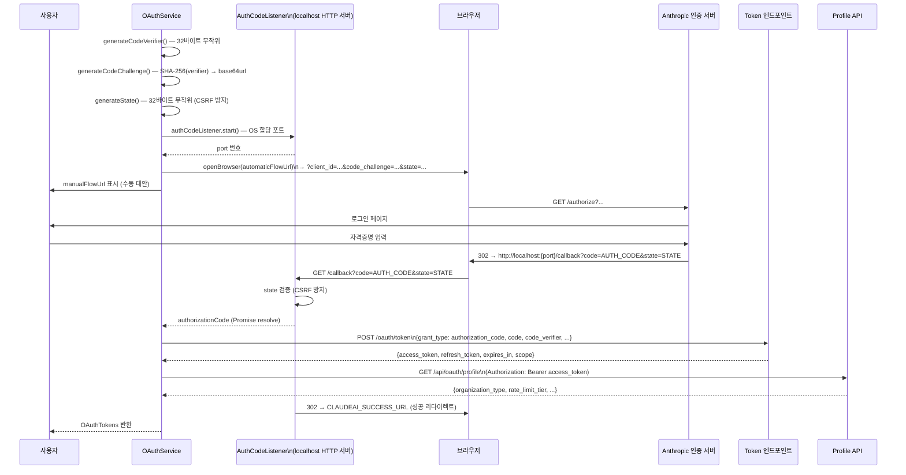
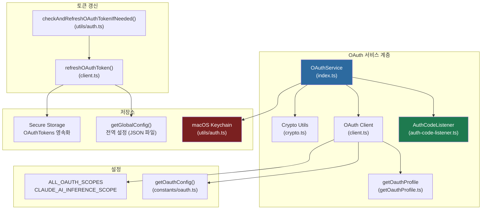

# 인증 흐름 분석: OAuth 2.0, macOS Keychain, JWT 검증

> **레벨**: 내부 구현 (Level 3)
> **대상 독자**: Claude Code 핵심 기여자, 인증 통합 개발자
> **관련 소스**: `src/services/oauth/`

---

## 개요

Claude Code의 인증 시스템은 OAuth 2.0 Authorization Code Flow with PKCE(Proof Key for Code Exchange)를 기반으로 구현되어 있다. 단순한 OAuth 클라이언트 구현을 넘어, 두 가지 인증 경로(자동/수동), 토큰 갱신 최적화, 프로필 캐싱, 그리고 비-브라우저 환경 지원을 통합한다.

핵심 클래스인 `OAuthService`는 상태 기계(state machine)처럼 동작한다: `codeVerifier`와 `authCodeListener`를 인스턴스 내부에 캡슐화하여, 플로우의 각 단계가 올바른 순서로 실행되도록 보장한다. 외부 저장소(macOS Keychain)와의 연동은 `src/utils/auth.ts`의 상위 계층에서 처리된다.

---

## 아키텍처 다이어그램

### OAuth 2.0 PKCE 플로우



### 인증 컴포넌트 의존 관계



---

## 핵심 구현 분석

### 1. PKCE 암호 기법 (`crypto.ts`)

PKCE는 인증 코드 탈취 공격을 방지하기 위한 RFC 7636 표준 확장이다.

```typescript
// 코드 검증자: 32바이트 무작위 → base64url
export function generateCodeVerifier(): string {
  return base64URLEncode(randomBytes(32))  // Node.js crypto 모듈
}

// 코드 챌린지: SHA-256(verifier) → base64url
export function generateCodeChallenge(verifier: string): string {
  const hash = createHash('sha256')
  hash.update(verifier)
  return base64URLEncode(hash.digest())
}

// CSRF 방지 상태값: 32바이트 무작위
export function generateState(): string {
  return base64URLEncode(randomBytes(32))
}

// base64url: 표준 base64에서 +→-, /→_, = 제거
function base64URLEncode(buffer: Buffer): string {
  return buffer.toString('base64')
    .replace(/\+/g, '-').replace(/\//g, '_').replace(/=/g, '')
}
```

`code_challenge_method: 'S256'`을 사용하여 검증자의 SHA-256 해시를 챌린지로 전송한다. 인증 서버는 토큰 교환 시 수신한 `code_verifier`를 해싱하여 챌린지와 일치하는지 검증한다.

### 2. 로컬 콜백 서버 (`auth-code-listener.ts`)

`AuthCodeListener`는 OAuth 리다이렉트를 포착하기 위한 임시 HTTP 서버다. OS 할당 포트를 사용하여 포트 충돌을 방지한다.

```typescript
// 포트 0으로 리슨 → OS가 사용 가능한 포트 자동 할당
this.localServer.listen(port ?? 0, 'localhost', () => {
  const address = this.localServer.address() as AddressInfo
  this.port = address.port
  resolve(this.port)
})
```

**상태 검증**: 콜백 수신 시 `state` 파라미터를 초기 생성값과 비교하여 CSRF 공격을 방지한다.

```typescript
if (state !== this.expectedState) {
  res.writeHead(400)
  res.end('Invalid state parameter')
  this.reject(new Error('Invalid state parameter'))
  return
}
```

**지연 리다이렉트 패턴**: 인증 코드 포착 시 브라우저 응답(`ServerResponse`)을 즉시 종료하지 않고 `pendingResponse`에 보관한다. 토큰 교환 성공 후 `handleSuccessRedirect()`에서 최종 리다이렉트를 수행한다. 이 패턴은 사용자가 성공 페이지를 보기 전에 브라우저 연결이 끊기는 경쟁 조건을 방지한다.

```typescript
// 인증 코드 포착 → 응답 보류
this.pendingResponse = res
this.resolve(authCode)

// 나중에 토큰 교환 성공 후
handleSuccessRedirect(scopes: string[]): void {
  const successUrl = shouldUseClaudeAIAuth(scopes)
    ? getOauthConfig().CLAUDEAI_SUCCESS_URL
    : getOauthConfig().CONSOLE_SUCCESS_URL
  this.pendingResponse.writeHead(302, { Location: successUrl })
  this.pendingResponse.end()
  this.pendingResponse = null
}
```

### 3. 이중 플로우 지원 (`OAuthService.startOAuthFlow()`)

자동 플로우와 수동 플로우가 동시에 준비되어 경쟁한다:

```typescript
// 두 URL을 각각 생성
const manualFlowUrl  = client.buildAuthUrl({ ...opts, isManual: true  })
const automaticFlowUrl = client.buildAuthUrl({ ...opts, isManual: false })

// 자동: 브라우저를 자동으로 열기 + 콜백 리스너 대기
// 수동: 사용자가 URL을 복사해 붙여넣기
await authURLHandler(manualFlowUrl) // 수동 옵션 표시
await openBrowser(automaticFlowUrl) // 자동 플로우 시도
```

`skipBrowserOpen` 옵션은 SDK 제어 프로토콜(`claude_authenticate`)에서 사용된다. 이 경우 클라이언트가 표시 화면을 제어하므로 OAuthService가 직접 브라우저를 열지 않는다.

어느 플로우가 먼저 완료되든 `waitForAuthorizationCode()`의 Promise가 resolve된다. `isAutomaticFlow`는 `hasPendingResponse()`로 판별하며, 이에 따라 토큰 교환의 `redirect_uri` 파라미터가 결정된다.

### 4. URL 빌더 및 스코프 관리 (`client.ts`)

```typescript
export function buildAuthUrl({ codeChallenge, state, port, isManual, ... }): string {
  const authUrlBase = loginWithClaudeAi
    ? getOauthConfig().CLAUDE_AI_AUTHORIZE_URL
    : getOauthConfig().CONSOLE_AUTHORIZE_URL

  authUrl.searchParams.append('code', 'true') // Claude Max 업셀 표시 트리거
  authUrl.searchParams.append('client_id', getOauthConfig().CLIENT_ID)
  authUrl.searchParams.append('response_type', 'code')
  authUrl.searchParams.append(
    'redirect_uri',
    isManual
      ? getOauthConfig().MANUAL_REDIRECT_URL      // 수동: 고정 URL
      : `http://localhost:${port}/callback`,       // 자동: 로컬 콜백
  )
  // inferenceOnly: 장기 추론 전용 토큰 (스코프 최소화)
  const scopesToUse = inferenceOnly ? [CLAUDE_AI_INFERENCE_SCOPE] : ALL_OAUTH_SCOPES
  authUrl.searchParams.append('scope', scopesToUse.join(' '))
  authUrl.searchParams.append('code_challenge', codeChallenge)
  authUrl.searchParams.append('code_challenge_method', 'S256')
  authUrl.searchParams.append('state', state)
}
```

`CLAUDE_AI_INFERENCE_SCOPE`는 추론 전용 장기 토큰에 사용되는 최소 스코프다. 이 스코프로 발급된 토큰은 프로필 조회 등 다른 기능을 위해 추가 스코프 확장이 필요할 수 있다.

### 5. 토큰 교환 (`exchangeCodeForTokens()`)

```typescript
const requestBody = {
  grant_type: 'authorization_code',
  code: authorizationCode,
  redirect_uri: useManualRedirect
    ? getOauthConfig().MANUAL_REDIRECT_URL
    : `http://localhost:${port}/callback`,
  client_id: getOauthConfig().CLIENT_ID,
  code_verifier: codeVerifier,  // PKCE 검증자
  state,
  ...(expiresIn !== undefined && { expires_in: expiresIn }),
}

const response = await axios.post(getOauthConfig().TOKEN_URL, requestBody, {
  headers: { 'Content-Type': 'application/json' },
  timeout: 15000,  // 15초 타임아웃
})
```

`redirect_uri`는 인증 요청에서 사용한 값과 정확히 일치해야 한다. 자동/수동 플로우에 따라 이 값이 달라지므로, `isManual` 플래그를 `exchangeCodeForTokens()`에 전달하여 올바른 URI를 사용한다.

### 6. 토큰 갱신 최적화 (`refreshOAuthToken()`)

갱신 시 불필요한 프로필 API 호출을 회피하는 캐시 활용 로직이 핵심이다:

```typescript
// 이미 캐시된 프로필 정보가 있으면 API 호출 생략
const haveProfileAlready =
  config.oauthAccount?.billingType !== undefined &&
  config.oauthAccount?.accountCreatedAt !== undefined &&
  config.oauthAccount?.subscriptionCreatedAt !== undefined &&
  existing?.subscriptionType != null &&
  existing?.rateLimitTier != null

const profileInfo = haveProfileAlready ? null : await fetchProfileInfo(accessToken)
```

이 최적화는 하루 약 7백만 건의 불필요한 `/api/oauth/profile` 요청을 절감하는 효과가 있다. 단, `CLAUDE_CODE_OAUTH_REFRESH_TOKEN` 재로그인 경로에서는 `installOAuthTokens()`가 `performLogout()`을 실행하여 시큐어 스토리지를 초기화하기 때문에, `existing` 값이 `null`일 수 있다. 이 경우 캐시된 값을 우선 사용(`profileInfo?.subscriptionType ?? existing?.subscriptionType ?? null`)하여 가입 유형 정보 손실을 방지한다.

스코프 확장도 지원한다:
```typescript
scope: (requestedScopes?.length ? requestedScopes : CLAUDE_AI_OAUTH_SCOPES).join(' ')
```

백엔드의 refresh-token 그랜트는 `ALLOWED_SCOPE_EXPANSIONS`에 정의된 범위 내에서 초기 인증 시 부여된 스코프를 초과하는 스코프 요청을 허용한다.

### 7. 프로필 정보 조회 및 구독 유형 분류 (`fetchProfileInfo()`)

```typescript
export async function fetchProfileInfo(accessToken: string) {
  const profile = await getOauthProfileFromOauthToken(accessToken)
  const orgType = profile?.organization?.organization_type

  // 조직 유형 → 구독 유형 매핑
  switch (orgType) {
    case 'claude_max':        subscriptionType = 'max'; break
    case 'claude_pro':        subscriptionType = 'pro'; break
    case 'claude_enterprise': subscriptionType = 'enterprise'; break
    case 'claude_team':       subscriptionType = 'team'; break
    default:                  subscriptionType = null; break
  }

  return {
    subscriptionType,
    rateLimitTier: profile?.organization?.rate_limit_tier ?? null,
    hasExtraUsageEnabled: profile?.organization?.has_extra_usage_enabled ?? null,
    billingType: profile?.organization?.billing_type ?? null,
    displayName: profile?.account?.display_name,
    accountCreatedAt: profile?.account?.created_at,
    subscriptionCreatedAt: profile?.organization?.subscription_created_at,
    rawProfile: profile,
  }
}
```

`rawProfile`을 포함하여 반환하는 이유는 상위 계층에서 추가 필드에 접근할 수 있도록 하기 위함이다.

### 8. 토큰 만료 검사 (`isOAuthTokenExpired()`)

```typescript
export function isOAuthTokenExpired(expiresAt: number | null): boolean {
  if (expiresAt === null) return false  // 만료 정보 없으면 유효로 처리

  const bufferTime = 5 * 60 * 1000  // 5분 버퍼
  const expiresWithBuffer = Date.now() + bufferTime
  return expiresWithBuffer >= expiresAt
}
```

만료 5분 전을 만료로 처리하는 버퍼 설계는 `jwtUtils.ts`의 `TOKEN_REFRESH_BUFFER_MS`와 동일한 값을 사용하여 일관성을 유지한다.

### 9. 환경변수 폴백 메커니즘 (`populateOAuthAccountInfoIfNeeded()`)

SDK 통합 시나리오(예: Cowork)에서는 환경변수로 계정 정보를 주입할 수 있다:

```typescript
const envAccountUuid = process.env.CLAUDE_CODE_ACCOUNT_UUID
const envUserEmail = process.env.CLAUDE_CODE_USER_EMAIL
const envOrganizationUuid = process.env.CLAUDE_CODE_ORGANIZATION_UUID

if (envAccountUuid && envUserEmail && envOrganizationUuid) {
  storeOAuthAccountInfo({ accountUuid: envAccountUuid, emailAddress: envUserEmail, ... })
}
```

환경변수 설정 후에도 실제 프로필 API 조회가 성공하면 API 응답이 환경변수 값을 덮어쓴다. 초기 텔레메트리 이벤트에서 계정 정보가 누락되는 경쟁 조건을 해결하기 위한 설계다.

---

## 설계 결정

### PKCE 의무화

모든 OAuth 플로우에서 PKCE가 필수다. 클라이언트 시크릿을 사용하지 않는 공개 클라이언트(CLI 도구)에서 인증 코드 가로채기 공격을 방지하기 위함이다. `code_challenge_method: 'S256'` (SHA-256)이 평문 방식(`plain`)보다 항상 선호된다.

### 이중 플로우 동시 경쟁

자동 플로우(브라우저 리다이렉트)와 수동 플로우(코드 붙여넣기)가 동시에 준비되어 먼저 완료되는 쪽이 채택된다. 헤드리스 서버 환경에서 브라우저를 열 수 없는 경우에도 수동 플로우로 인증이 가능하다. `skipBrowserOpen` 옵션은 이 패턴을 SDK 호출자가 완전히 제어할 수 있도록 확장한 것이다.

### 조직 UUID 조회 전략

`getOrganizationUUID()`는 네트워크 왕복을 최소화하기 위해 전역 설정을 우선 확인한다:

```typescript
// 1순위: 전역 설정 캐시
const orgUUID = globalConfig.oauthAccount?.organizationUuid
if (orgUUID) return orgUUID

// 2순위: 프로필 API (user:profile 스코프 필요)
const profile = await getOauthProfileFromOauthToken(accessToken)
```

`user:profile` 스코프가 없는 토큰은 프로필 API를 호출할 수 없으므로 `hasProfileScope()` 검사 후 폴백한다.

### 역할 정보 별도 API (`fetchAndStoreUserRoles()`)

`/roles` 엔드포인트에서 조직 역할(`organization_role`), 워크스페이스 역할(`workspace_role`), 조직명을 가져와 전역 설정에 저장한다. 프로필 API와 별개의 엔드포인트를 사용하는 이유는 역할 정보가 자주 변경될 수 있어 선택적으로 새로고침이 필요하기 때문이다.

### API 키 프로비저닝 (`createAndStoreApiKey()`)

OAuth 플로우 완료 후 자동으로 API 키를 생성하여 Keychain에 저장하는 옵션을 제공한다. 이는 OAuth 토큰 없이 직접 API 키로 인증하는 시나리오를 지원하며, 특히 자동화 환경에서 유용하다.

---

## 관련 파일 참조

| 파일 | 역할 |
|------|------|
| `src/services/oauth/index.ts` | `OAuthService` 메인 클래스 |
| `src/services/oauth/auth-code-listener.ts` | 로컬 OAuth 콜백 HTTP 서버 |
| `src/services/oauth/client.ts` | URL 빌더, 토큰 교환, 갱신, 프로필 조회 |
| `src/services/oauth/crypto.ts` | PKCE 암호 유틸리티 |
| `src/services/oauth/getOauthProfile.ts` | 프로필 API 호출 |
| `src/constants/oauth.ts` | OAuth 설정 (엔드포인트 URL, 클라이언트 ID, 스코프) |
| `src/utils/auth.ts` | Keychain 연동, 토큰 저장/조회, 갱신 조율 |
| `src/bridge/jwtUtils.ts` | JWT 디코딩, 브릿지 세션 토큰 갱신 스케줄러 |

---

## 탐색 링크

- [IDE 브릿지 분석](./bridge-ide.md)
- [컨텍스트 압축 & 토큰 관리](./context-compression.md)
- [Level 2: 아키텍처 개요](../level-1-overview/architecture.md)
