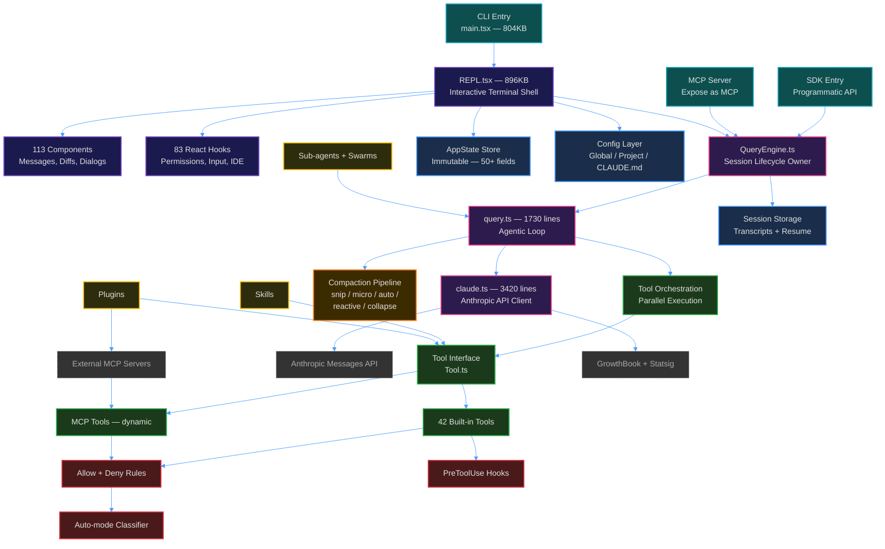

# 1. System Overview

> The entire Claude Code architecture in one diagram, then unpacked layer by layer.

---

## The Big Picture

Claude Code is structured in **8 distinct layers**, each with a clear responsibility. Understanding these layers is the key to navigating the 512K-line codebase.



---

## Layer 1: Entry Points

There are **three ways** into Claude Code:

| Entry | File | How It Works |
|-------|------|-------------|
| **CLI** | `src/main.tsx` (804KB) | Commander.js parses args → boots React/Ink → renders `REPL.tsx` |
| **SDK** | `src/entrypoints/sdk/` | Programmatic API → creates `QueryEngine` directly |
| **MCP Server** | `src/entrypoints/mcp.ts` | Exposes Claude Code itself as an MCP server |

### Key Insight: Parallel Prefetch

Startup time is critical for a CLI tool. Claude Code parallelizes heavy work *before* any module evaluation:

```typescript
// main.tsx — fired as side-effects before other imports
startMdmRawRead()      // MDM settings (enterprise)
startKeychainPrefetch() // API key from macOS Keychain
```

Heavy modules like OpenTelemetry (~400KB) and gRPC (~700KB) are loaded lazily via dynamic `import()` only when needed.

---

## Layer 2: UI — React in a Terminal

This is where it gets wild. Claude Code uses **React** (yes, the web framework) to render a terminal UI via [Ink](https://github.com/vadimdemedes/ink).

| What | Count | Examples |
|------|-------|---------|
| Components | 113 files | Messages, Diffs, Dialogs, Settings, Spinners |
| React Hooks | 83 files | `useCanUseTool`, `useVoice`, `useReplBridge`, `useTypeahead` |

The crown jewel is `REPL.tsx` at **896KB** — a single React component that is the entire interactive terminal experience. It handles:

- Message rendering and virtual scrolling
- Permission dialogs
- Tool progress indicators
- Keyboard shortcuts and vim mode
- Voice input
- IDE bridge integration
- Background task management

### Why React for a CLI?

React's component model gives you:
- **Declarative UI** — Describe what to render, not how
- **Hooks** — Share stateful logic across 83 hooks
- **State management** — AppState drives re-renders
- **Composability** — 113 components snap together

---

## Layer 3: Core Engine

The engine has three key files forming a pipeline:

```
QueryEngine.ts → query.ts → claude.ts
(session owner)   (loop)     (API client)
```

1. **`QueryEngine.ts`** — Owns the session lifecycle. Creates a conversation, manages transcripts, tracks usage, and handles resume.

2. **`query.ts`** — The **agentic loop**. This is the beating heart. It cycles between calling the model and executing tools until the model says `end_turn`. (See [Guide 2: The Agentic Loop](./02-agentic-loop.md))

3. **`claude.ts`** — The Anthropic API client. Handles streaming SSE responses, retry logic (429/529), prompt caching, and model fallback. (See [Guide 8: API Client](./08-api-client.md))

---

## Layer 4: Tool System

Every capability Claude Code has — reading files, running bash, searching the web — is implemented as a **Tool**. There are 42 built-in tools, plus dynamic MCP tools loaded at runtime.

Tools are self-contained modules with a standard interface defined in `Tool.ts` (793 lines):

```typescript
type Tool = {
  name: string
  inputSchema: ZodSchema       // Validate inputs
  checkPermissions(input, ctx)  // Permission check
  call(input, ctx)              // Execute
  prompt(options)               // Describe to model
  renderToolUseMessage(input)   // Terminal rendering
  // ... 30+ more methods
}
```

Full breakdown in [Guide 3: Tool System](./03-tool-system.md).

---

## Layer 5: Context Management

LLMs have finite context windows. Claude Code has a sophisticated **5-stage compaction pipeline** to keep conversations within limits:

1. **Snip Compact** — Sliding window, drop oldest turns
2. **Micro Compact** — Truncate oversized individual tool results
3. **Auto Compact** — Summarize via a separate API call
4. **Context Collapse** — Read-time projection with archived views
5. **Reactive Compact** — Emergency trigger on API 413 errors

Full breakdown in [Guide 5: Context Management](./05-context-management.md).

---

## Layer 6: Permission System

Claude Code can run arbitrary bash commands and write to any file. The permission system is a multi-layered defense:

```
Deny Rules → Allow Rules → Tool Check → Hooks → Classifier → User Dialog
```

Four distinct permission modes: Default, Plan, Auto, and Bypass.

Full breakdown in [Guide 4: Permission System](./04-permission-system.md).

---

## Layer 7: State Management

All application state lives in a **single immutable store** (`AppState`) with 50+ fields, following a simplified Redux pattern:

- **Consumers** read state via `getAppState()` or React's `useAppState(selector)`
- **Mutators** update via `setAppState(prev => newState)` (functional updates)
- **Side effects** fire via `onChangeAppState` listeners
- The `DeepImmutable<T>` type wrapper enforces immutability at the type level

Full breakdown in [Guide 6: State Management](./06-state-management.md).

---

## Layer 8: Extensions

Claude Code is extensible through four mechanisms:

| Mechanism | What | Where |
|-----------|------|-------|
| **Skills** | Markdown instruction files | `.claude/skills/*.md` |
| **Plugins** | Bundles of tools + MCP servers | Managed or user-installed |
| **Hooks** | Pre/PostToolUse scripts | `settings.json` or CLAUDE.md |
| **Agents** | Sub-agents, coordinators, swarms | AgentTool, tmux-based swarms |

Full breakdown in [Guide 7: Extension Model](./07-extension-model.md).

---

## External Dependencies

| Dependency | Role |
|-----------|------|
| **Anthropic Messages API** | The LLM backend — all model calls go here |
| **External MCP Servers** | Third-party tools exposed via Model Context Protocol |
| **GrowthBook** | Feature flags — gates like `VOICE_MODE`, `PROACTIVE`, `CONTEXT_COLLAPSE` |
| **Statsig** | Additional analytics and experimentation |

---

## Design Principles

Looking at the codebase, several design principles emerge:

1. **Feature flags for dead code elimination** — `feature('X')` from `bun:bundle` strips unused code at build time
2. **Lazy loading** — Heavy modules are `import()`ed only when needed
3. **Immutable state** — `DeepImmutable<T>` enforces no mutation
4. **Generator-based streaming** — `async function*` throughout for backpressure-aware streaming
5. **Self-contained tools** — Each tool is a module with schema, permissions, execution, and rendering

---

**Next:** [The Agentic Loop →](./02-agentic-loop.md)
