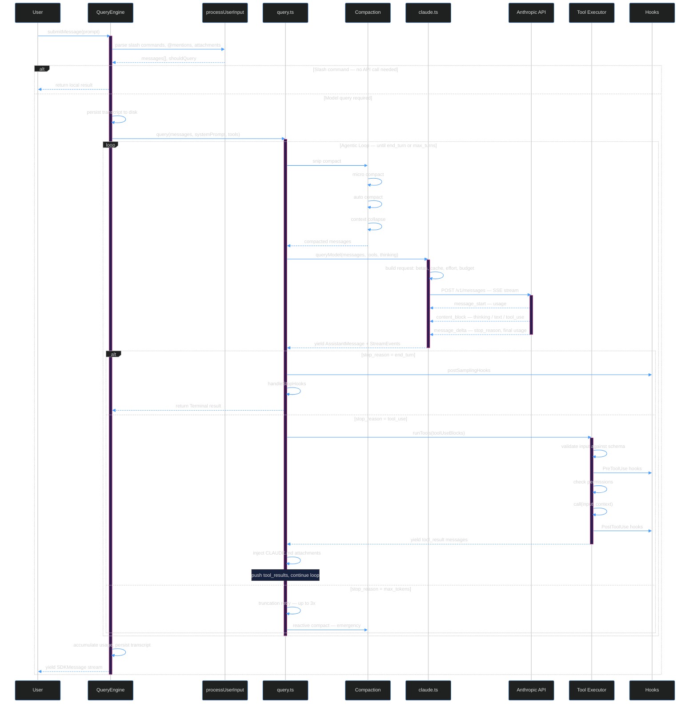

# 2. The Agentic Loop

> How Claude Code cycles between the model and tools — the core of the entire system.

---

## What Is the "Agentic Loop"?

The agentic loop is the mechanism that makes Claude Code more than a chatbot. Instead of:

```
User → Model → Response (done)
```

Claude Code does:

```
User → Model → Tool Call → Model → Tool Call → ... → Response (done)
```

The model can call tools, see results, and decide what to do next — in a **loop** — until it decides it's finished. This loop lives in **`query.ts`** (1,730 lines), and it's the most important file in the entire codebase.

---

## The Full Sequence



---

## Anatomy of `query.ts`

The file exports a single async generator function:

```typescript
export async function* query(params: QueryParams):
  AsyncGenerator<StreamEvent | Message | ToolUseSummaryMessage, Terminal> {
  // ... 1,730 lines of agentic loop
}
```

### Why an Async Generator?

This is a crucial design decision. An async generator (`async function*`) lets query.ts:

1. **Yield messages as they arrive** — The consumer (REPL or SDK) sees each message in real-time
2. **Maintain backpressure** — The loop pauses if the consumer isn't ready
3. **Support cancellation** — `.return()` on the generator cleanly tears down the loop
4. **Compose generators** — `yield*` delegates to sub-generators seamlessly

### The Loop State

Each loop iteration carries mutable state:

```typescript
type State = {
  messages: Message[]                      // Conversation history
  toolUseContext: ToolUseContext            // Tool execution context
  autoCompactTracking: AutoCompactTrackingState  // Compact progress
  maxOutputTokensRecoveryCount: number     // Truncation retry counter
  hasAttemptedReactiveCompact: boolean     // Emergency compact flag
  turnCount: number                        // Loop iteration counter
  pendingToolUseSummary: Promise<...>       // Async summary generation
  transition: Continue | undefined         // Why we're in this iteration
}
```

---

## Phase 1: Pre-Processing — Before the API Call

Before every API call, query.ts runs a **compaction pipeline** on the message history:

```typescript
// 1. Apply per-message tool result budgets
messagesForQuery = await applyToolResultBudget(messagesForQuery, ...)

// 2. Snip compact — sliding window over old turns
if (feature('HISTORY_SNIP')) {
  const snipResult = snipModule.snipCompactIfNeeded(messagesForQuery)
  messagesForQuery = snipResult.messages
}

// 3. Micro compact — truncate oversized tool results
const microcompactResult = await deps.microcompact(messagesForQuery, ...)
messagesForQuery = microcompactResult.messages

// 4. Context collapse — read-time projection
if (feature('CONTEXT_COLLAPSE') && contextCollapse) {
  const collapseResult = await contextCollapse.applyCollapsesIfNeeded(...)
  messagesForQuery = collapseResult.messages
}

// 5. Auto compact — full summarization via API
const { compactionResult } = await deps.autocompact(messagesForQuery, ...)
```

Each stage is feature-gated and runs **independently**. They compose — snip reduces history, micro truncates individual results, auto summarizes the whole thing, collapse archives old views.

### Blocking Limit Check

After compaction, the loop checks if we're at the **blocking limit** (>98% context used):

```typescript
const { isAtBlockingLimit } = calculateTokenWarningState(
  tokenCountWithEstimation(messagesForQuery),
  toolUseContext.options.mainLoopModel,
)
if (isAtBlockingLimit) {
  yield createAssistantAPIErrorMessage({ content: PROMPT_TOO_LONG_ERROR_MESSAGE })
  return { reason: 'blocking_limit' }
}
```

This prevents the API call entirely if we know it'll fail.

---

## Phase 2: The API Call

The actual model call uses `claude.ts`:

```typescript
for await (const message of deps.callModel({
  messages: prependUserContext(messagesForQuery, userContext),
  systemPrompt: fullSystemPrompt,
  thinkingConfig: toolUseContext.options.thinkingConfig,
  tools: toolUseContext.options.tools,
  signal: toolUseContext.abortController.signal,
  options: {
    model: currentModel,
    fallbackModel,
    effortValue: appState.effortValue,
    taskBudget: params.taskBudget,
    // ... 20+ more options
  },
})) {
  // Process each streamed message
}
```

Responses stream in as SSE events. The loop processes three content block types:

| Block Type | What Happens |
|-----------|-------------|
| `thinking` | Rendered in UI, not sent back to model |
| `text` | Rendered as markdown in terminal |
| `tool_use` | Triggers tool execution (next phase) |

---

## Phase 3: Tool Execution

When the model responds with `tool_use` blocks, the loop executes them:

```typescript
// Parallel tool execution
const toolResults = yield* runTools(toolUseBlocks, canUseTool, toolUseContext)
```

### Streaming Tool Execution

A performance optimization: tools can begin executing **while the model is still streaming**:

```typescript
const useStreamingToolExecution = config.gates.streamingToolExecution
let streamingToolExecutor = useStreamingToolExecution
  ? new StreamingToolExecutor(tools, canUseTool, toolUseContext)
  : null
```

The `StreamingToolExecutor` starts validating and permission-checking tool calls as their blocks arrive, before the full response is complete.

### Tool Lifecycle

Each tool goes through:

1. **Schema Validation** — Zod validates the input against `tool.inputSchema`
2. **PreToolUse Hooks** — User-defined scripts can approve, deny, or modify the input
3. **Permission Check** — Deny rules → Allow rules → Tool-specific check → Classifier → User dialog
4. **Execution** — `tool.call(input, context)` runs the actual operation
5. **PostToolUse Hooks** — Scripts run after execution with the result

---

## Phase 4: Loop Continuation

After tools execute, the loop decides what to do next based on the `stop_reason`:

### `end_turn` — Model is done

```typescript
if (stop_reason === 'end_turn') {
  // Run post-sampling hooks
  await executePostSamplingHooks(assistantMessage, toolUseContext)
  // Check stop hooks (can force continuation)
  const stopResult = await handleStopHooks(assistantMessage, messages)
  if (stopResult.shouldContinue) {
    // Inject hook feedback and continue loop
  } else {
    return { reason: 'end_turn' }  // Terminal — loop exits
  }
}
```

### `tool_use` — Model wants to use tools

The tool results are pushed to messages and the loop continues:

```typescript
messages.push(...toolResults)
// Inject CLAUDE.md attachments for newly-discovered memory files
const attachments = await getAttachmentMessages(messages, toolUseContext)
messages.push(...attachments)
// Continue to next iteration (back to Phase 1)
```

### `max_tokens` — Response was truncated

```typescript
if (maxOutputTokensRecoveryCount < MAX_OUTPUT_TOKENS_RECOVERY_LIMIT) {
  // Retry with increased max_tokens
  state.maxOutputTokensRecoveryCount++
  continue
} else {
  // Trigger reactive compact as last resort
  state.hasAttemptedReactiveCompact = true
}
```

---

## QueryEngine: The Session Wrapper

`QueryEngine.ts` wraps `query()` in a session lifecycle:

```typescript
class QueryEngine {
  private mutableMessages: Message[]
  private totalUsage: NonNullableUsage
  private readFileState: FileStateCache

  async *submitMessage(prompt): AsyncGenerator<SDKMessage> {
    // 1. Parse user input (slash commands, @mentions)
    const { messages, shouldQuery } = await processUserInput({ input: prompt })

    // 2. Persist transcript to disk
    await recordTranscript(messages)

    // 3. Run the agentic loop
    if (shouldQuery) {
      for await (const message of query({ messages, systemPrompt, tools })) {
        // 4. Map internal messages to SDK format
        yield normalizedSDKMessage(message)
        // 5. Persist each message
        await recordTranscript(messages)
      }
    }

    // 6. Return final result with usage stats
    yield { type: 'result', total_cost_usd, usage, duration_ms }
  }
}
```

---

## Key Patterns to Understand

### 1. Generator Composition

The codebase uses `yield*` heavily to compose generators:

```typescript
// query.ts delegates to sub-generators
yield* runTools(toolUseBlocks, canUseTool, toolUseContext)

// QueryEngine delegates to query
for await (const message of query(params)) {
  yield* normalizeMessage(message)
}
```

### 2. Feature-Gated Loading

Code paths are gated by build-time feature flags:

```typescript
const reactiveCompact = feature('REACTIVE_COMPACT')
  ? require('./services/compact/reactiveCompact.js')
  : null

// Later...
if (reactiveCompact?.isReactiveCompactEnabled()) {
  // This entire branch is eliminated in builds where REACTIVE_COMPACT is false
}
```

### 3. Tombstone Messages

When a streaming fallback occurs (model switch mid-stream), orphaned messages are tombstoned:

```typescript
for (const msg of assistantMessages) {
  yield { type: 'tombstone', message: msg }  // Removed from UI + transcript
}
assistantMessages.length = 0  // Reset
```

### 4. Task Budget Tracking

API-level task budgets track spend across compaction boundaries:

```typescript
if (params.taskBudget) {
  const preCompactContext = finalContextTokensFromLastResponse(messagesForQuery)
  taskBudgetRemaining = Math.max(
    0,
    (taskBudgetRemaining ?? params.taskBudget.total) - preCompactContext,
  )
}
```

---

## Common Debugging Scenarios

| Symptom | Where to Look |
|---------|--------------|
| Loop never stops | Check `maxTurns` limit, `handleStopHooks` |
| Tool not executing | Permission system — check deny rules, hooks, classifier |
| Context too large | Compaction pipeline — which stage is failing? |
| Model fallback | `withRetry` in claude.ts — 529 overloaded triggers |
| Truncation errors | `MAX_OUTPUT_TOKENS_RECOVERY_LIMIT` (3 retries) |

---

**Previous:** [← System Overview](./01-system-overview.md) · **Next:** [Tool System →](./03-tool-system.md)
