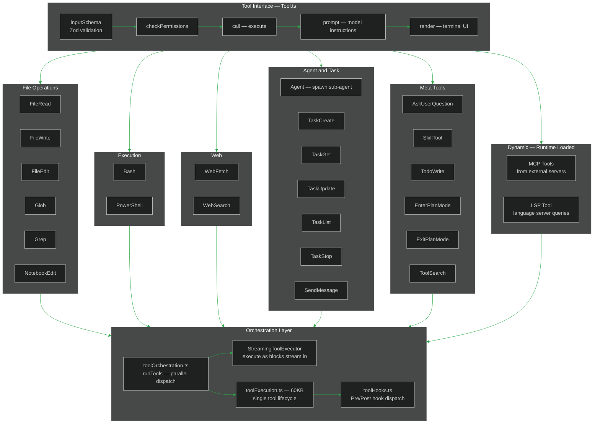
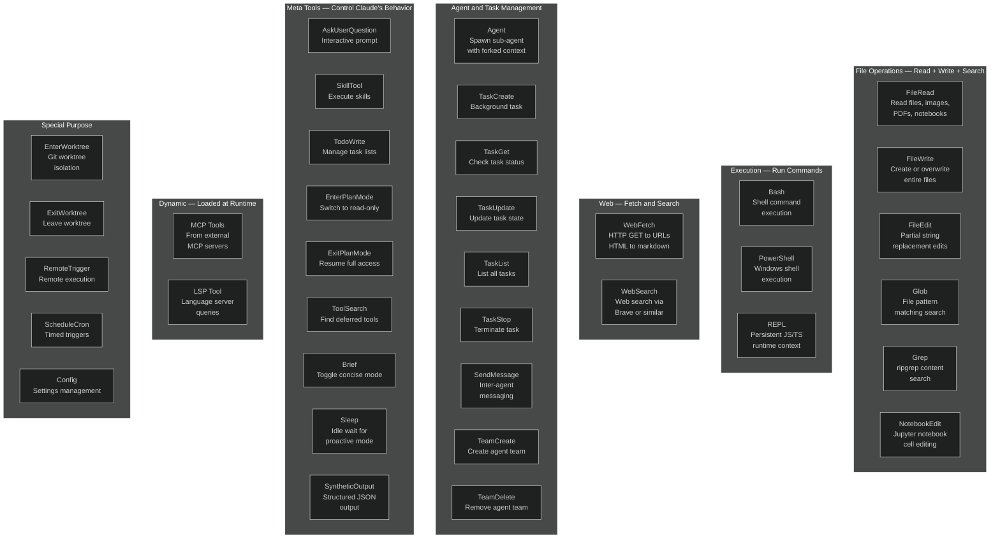
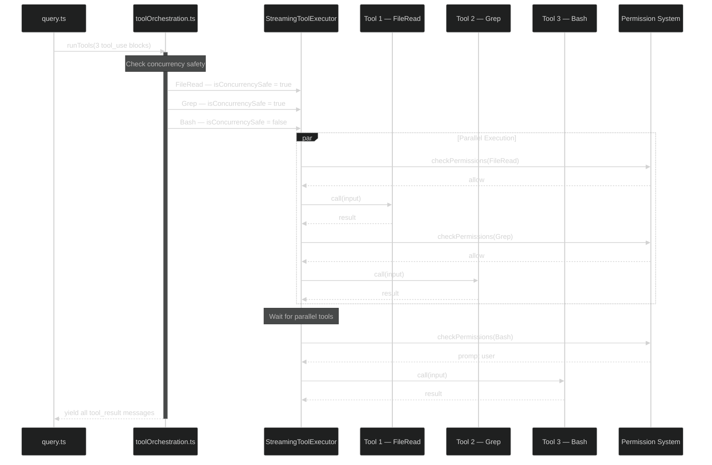
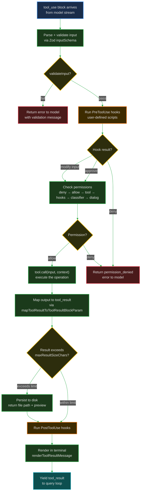
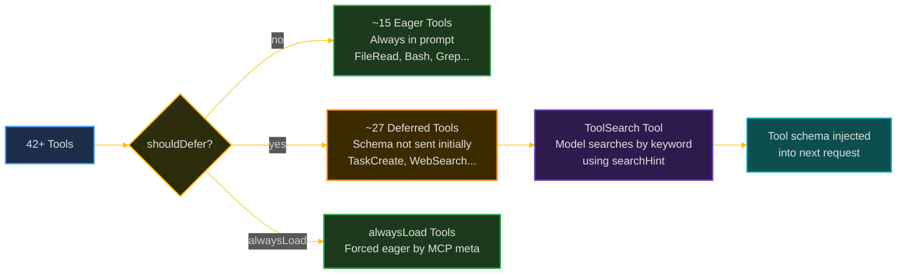
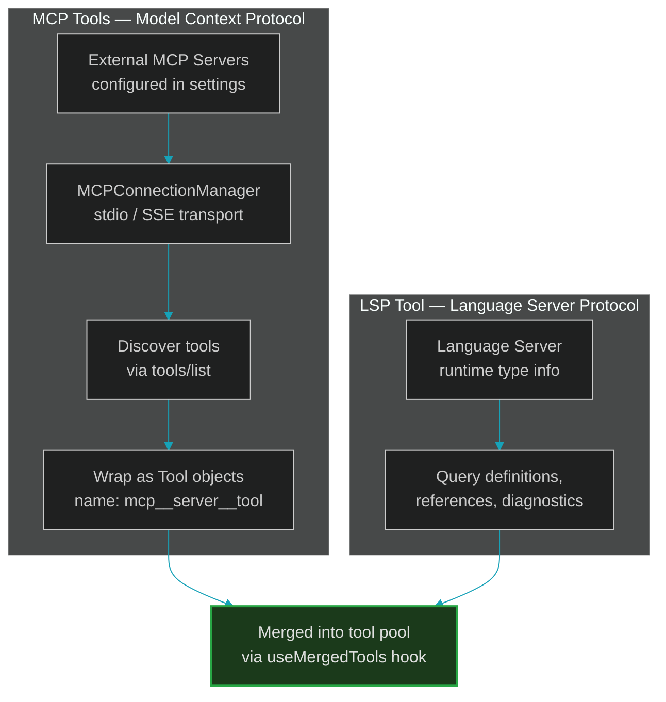

# 3. Tool System

> How 42 built-in tools are defined, validated, orchestrated, and rendered.

---

## Overview

Every capability Claude Code has — reading files, running bash, editing code, searching the web — is a **Tool**. Tools are the bridge between the model's intentions and the real world.



---

## The Tool Interface — `Tool.ts` (793 lines)

```mermaid
%%{init: {'theme': 'dark', 'themeVariables': { 'primaryColor': '#1a1a2e', 'primaryTextColor': '#e0e0e0', 'lineColor': '#28a745', 'primaryBorderColor': '#28a745'}}}%%
flowchart LR
    subgraph Definition["Tool Definition"]
        NAME["name: string"]
        SCHEMA["inputSchema: Zod"]
        ALIASES["aliases?: string array"]
        HINT["searchHint?: string"]
    end

    subgraph Lifecycle["Lifecycle Methods"]
        VAL["validateInput<br/>pre-execution check"]
        PERM["checkPermissions<br/>allow / deny / prompt"]
        CALL["call<br/>execute the tool"]
        DESC["description<br/>model-facing summary"]
    end

    subgraph Rendering["Rendering Methods"]
        RUM["renderToolUseMessage<br/>show input in terminal"]
        RRM["renderToolResultMessage<br/>show output in terminal"]
        RPM["renderToolUseProgressMessage<br/>spinner / progress bar"]
        GRP["renderGroupedToolUse<br/>parallel display"]
    end

    subgraph Metadata["Metadata Methods"]
        RO["isReadOnly<br/>does it write?"]
        CS["isConcurrencySafe<br/>parallel safe?"]
        EN["isEnabled<br/>available now?"]
        DS["isDestructive<br/>irreversible?"]
        AC["toAutoClassifierInput<br/>safety classifier text"]
    end

    Definition --> Lifecycle --> Rendering
    Definition --> Metadata
```

Every tool implements the `Tool<Input, Output, Progress>` type. Here are the key methods:



### The `buildTool` Factory

All tools go through `buildTool()` which provides safe defaults:

```typescript
const TOOL_DEFAULTS = {
  isEnabled: () => true,
  isConcurrencySafe: () => false,    // Assume not safe
  isReadOnly: () => false,            // Assume writes
  isDestructive: () => false,
  checkPermissions: (input) =>        // Defer to general system
    Promise.resolve({ behavior: 'allow', updatedInput: input }),
  toAutoClassifierInput: () => '',    // Skip classifier
  userFacingName: () => '',
}

export function buildTool(def) {
  return { ...TOOL_DEFAULTS, userFacingName: () => def.name, ...def }
}
```

This "fail-closed" design means a tool that forgets to implement `isConcurrencySafe` defaults to `false` (not safe for parallel execution).

---

## The 42 Built-in Tools



---

## Tool Orchestration — Parallel Execution

When the model returns multiple `tool_use` blocks, Claude Code can execute them **in parallel**:



Key files in the orchestration layer:

- **`toolOrchestration.ts`** — `runTools()`: dispatches tools, handles parallel vs. sequential
- **`StreamingToolExecutor`** — Starts permission checks while model is still streaming
- **`toolExecution.ts`** (60KB) — Single tool lifecycle: validate → permissions → execute → hooks
- **`toolHooks.ts`** — Dispatches PreToolUse and PostToolUse hooks

---

## Single Tool Lifecycle



---

## ToolSearch — Deferred Tool Loading

With 42+ tools, sending all schemas to the model wastes tokens. **ToolSearch** defers tools that aren't immediately needed:



---

## Dynamic Tools — MCP and LSP

Beyond built-in tools, Claude Code loads tools dynamically at runtime:



MCP tools are prefixed with `mcp__<server>__<tool>` unless running in SDK no-prefix mode. They go through the same permission system as built-in tools.

---

## Key Design Decisions

### 1. Self-Contained Modules

Each tool directory (`src/tools/<ToolName>/`) contains everything:
- `index.ts` — Tool definition via `buildTool()`
- `prompt.ts` — Model-facing instructions
- `*.test.ts` — Tests
- Additional helpers as needed

### 2. Fail-Closed Defaults

`buildTool()` defaults are conservative:
- `isConcurrencySafe = false` — Won't run in parallel unless explicitly safe
- `isReadOnly = false` — Assumed to write unless stated otherwise
- `checkPermissions` defaults to `allow` — But the general permission system still applies

### 3. Result Size Budgets

Each tool has `maxResultSizeChars`. Oversized results are persisted to disk and the model gets a truncated preview + file path. This prevents single tool results from consuming the entire context window.

### 4. Observable Input Backfilling

`backfillObservableInput()` adds derived fields to tool inputs for SDK consumers and transcripts, without mutating the API-bound input (which would break prompt caching):

```typescript
// The API sees: { file_path: "src/foo.ts" }
// SDK/transcript sees: { file_path: "src/foo.ts", resolved_path: "/abs/path/src/foo.ts" }
```

---

**Previous:** [← The Agentic Loop](./02-agentic-loop.md) · **Next:** [Permission System →](./04-permission-system.md)
