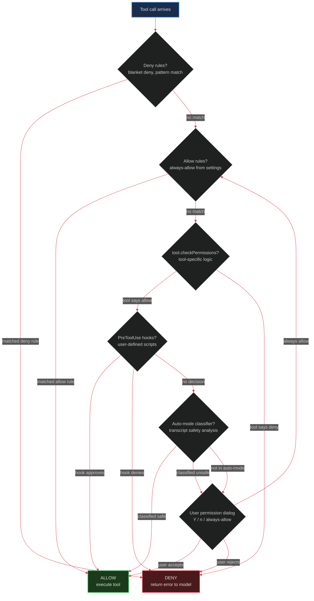
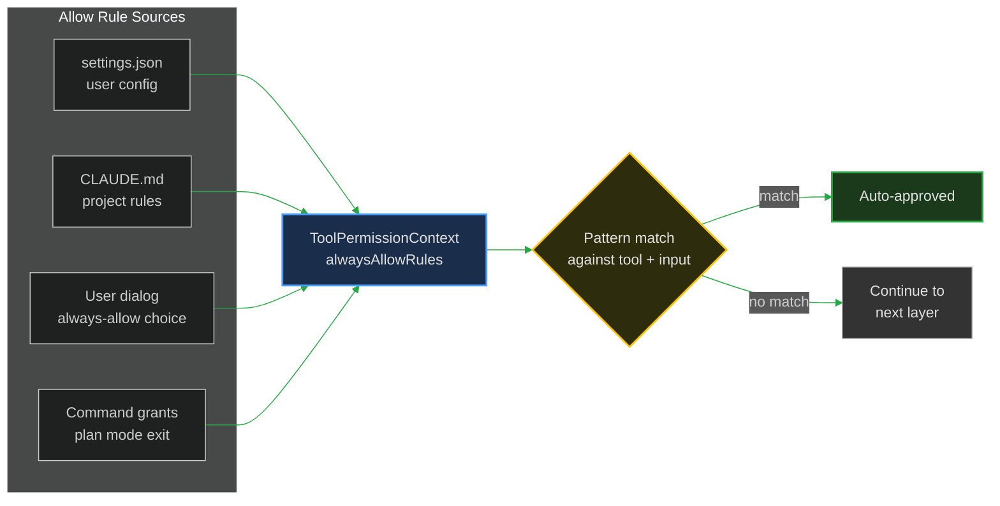
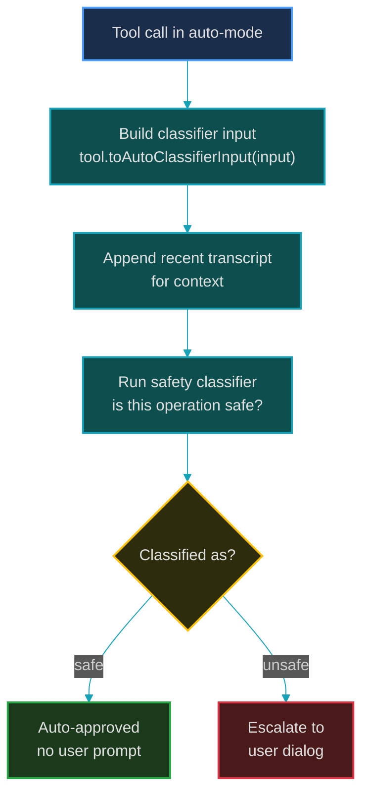
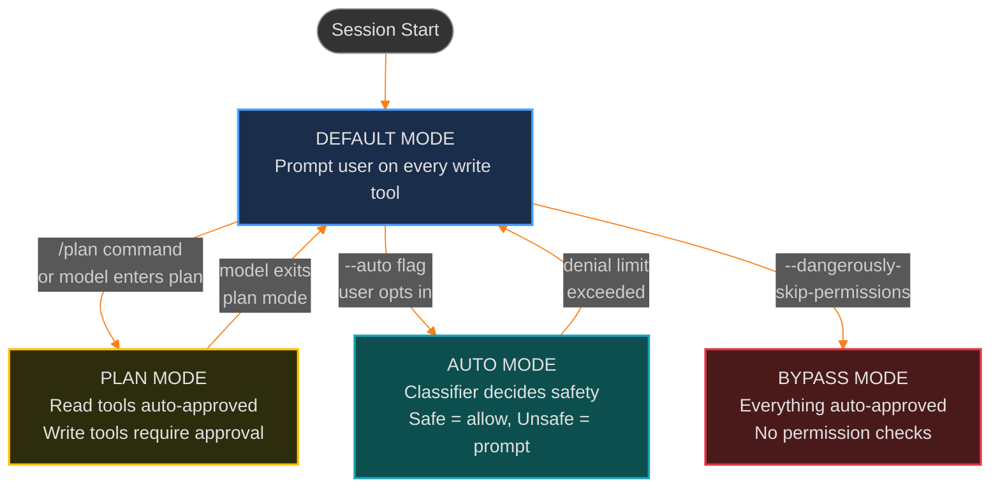
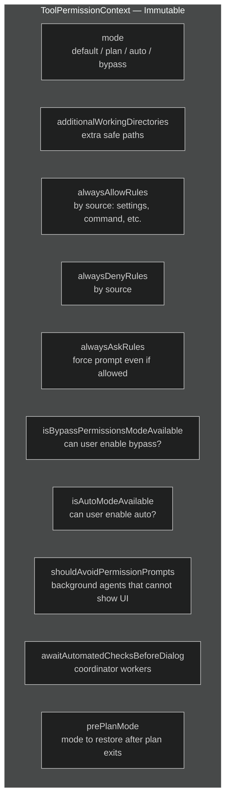
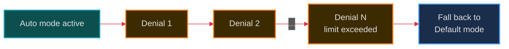

# 4. Permission System

> How Claude Code prevents an AI from doing dangerous things — a multi-layered defense.

---

## Why Permissions Matter

Claude Code can run **arbitrary bash commands**, **write to any file**, and **make network requests**. Without a permission system, a single misguided model response could `rm -rf /` your entire system.

The permission system is a chain of checks — if any link denies, the tool doesn't run.

---

## The Permission Flow



---

## Layer 1: Deny Rules

**First check. Highest priority. Cannot be overridden.**

Deny rules are pattern-matched against tool name and input. If a deny rule matches, the tool is **immediately rejected** — no further checks run.

Sources of deny rules:
- `settings.json` — User-configured
- CLAUDE.md — Project-level rules
- Organization policy — Enterprise MDM settings

Example deny rules:
```json
{
  "alwaysDenyRules": {
    "settings": [
      { "tool": "Bash", "pattern": "rm -rf" },
      { "tool": "FileWrite", "pattern": "/etc/*" }
    ]
  }
}
```

### Permission Matching

Tools can implement `preparePermissionMatcher()` for custom pattern matching:

```typescript
// Bash tool: "git *" matches any git command
preparePermissionMatcher(input) {
  return async (pattern) => minimatch(input.command, pattern)
}
```

---

## Layer 2: Allow Rules

If no deny rule matched, check if an **allow rule** grants automatic approval.

Allow rules come from:
- User clicking "always allow" in the permission dialog
- `settings.json` configuration
- Slash command grants (e.g., `/plan` exit grants specific operations)



---

## Layer 3: Tool-Specific Permissions

Each tool implements `checkPermissions(input, context)`:

```typescript
// Example: FileRead defaults to allow (it's read-only)
checkPermissions: () => Promise.resolve({ behavior: 'allow' })

// Example: Bash checks if the command is read-only
checkPermissions: (input) => {
  if (isReadOnlyCommand(input.command)) {
    return { behavior: 'allow' }
  }
  return { behavior: 'askUser', message: `Run: ${input.command}` }
}
```

The result can be:
- `{ behavior: 'allow' }` — Approved
- `{ behavior: 'deny', message }` — Rejected with reason
- `{ behavior: 'askUser', message }` — Escalate to user prompt

---

## Layer 4: PreToolUse Hooks

User-defined scripts that run before tool execution. Configured in `settings.json` or CLAUDE.md:

```json
{
  "hooks": {
    "PreToolUse": [
      {
        "matcher": "Bash",
        "command": "/path/to/safety-check.sh"
      }
    ]
  }
}
```

Hook scripts receive the tool name and input as JSON on stdin. They can:
- **Approve** (exit 0, no output)
- **Deny** (exit non-zero, stderr has reason)
- **Modify input** (exit 0, stdout has modified JSON)

---

## Layer 5: Auto-Mode Classifier

In `--auto` mode, a **classifier** examines the conversation transcript to determine if a tool call is safe:



Each tool provides `toAutoClassifierInput()` which returns a compact representation for the classifier. Security-irrelevant tools return `''` to skip classification.

---

## Layer 6: User Permission Dialog

The last resort — ask the human:

```
╭────────────────────────────────────────╮
│  Claude wants to run:                  │
│                                        │
│  $ npm install lodash                  │
│                                        │
│  (Y)es  ·  (n)o  ·  (a)lways allow    │
╰────────────────────────────────────────╯
```

Choosing "always allow" adds a permanent allow rule.

---

## Permission Modes



### Default Mode
- Every write operation prompts the user
- Read operations (FileRead, Glob, Grep) auto-approved
- Most secure, most friction

### Plan Mode
- Entered via `/plan` command or model's `EnterPlanMode` tool
- All read tools auto-approved
- All write tools require explicit user approval
- Model can plan freely, execute cautiously

### Auto Mode
- Enabled via `--auto` flag
- Safety classifier decides per-tool
- Falls back to prompting if classifier says "unsafe"
- Has a **denial limit** — too many denials drops back to Default

### Bypass Mode
- Enabled via `--dangerously-skip-permissions`
- **Everything auto-approved** — no checks at all
- Named to be scary because it IS scary
- No permission system protection whatsoever

---

## The `ToolPermissionContext` Type

All permission state lives in `AppState.toolPermissionContext`:



This is wrapped in `DeepImmutable<T>` — TypeScript enforces that nobody mutates this in place. Updates go through `setAppState(prev => ({ ...prev, toolPermissionContext: { ... } }))`.

---

## Denial Tracking

Auto mode tracks denials to prevent runaway unsafe operations:



This is stored in `DenialTrackingState` — for async subagents that can't show UI, a local tracking copy is used since their `setAppState` is a no-op.

---

**Previous:** [← Tool System](./03-tool-system.md) · **Next:** [Context Management →](./05-context-management.md)
