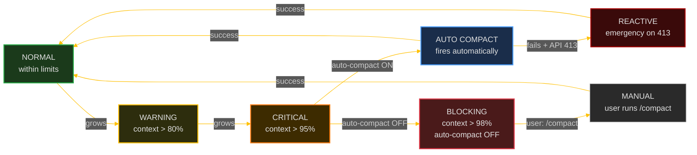

# 5. Context Management — The Compaction Pipeline

> How Claude Code keeps conversations within the model's context window.

---

## The Pipeline

```mermaid
%%{init: {'theme': 'dark', 'themeVariables': { 'primaryColor': '#1a1a2e', 'primaryTextColor': '#e0e0e0', 'lineColor': '#fd7e14', 'primaryBorderColor': '#fd7e14'}}}%%
flowchart LR
    RAW["Raw message<br/>history"]:::input

    S1["SNIP COMPACT<br/>Sliding window<br/>Drop oldest turns<br/>Preserve recent N"]:::stage1
    S2["MICRO COMPACT<br/>Truncate individual<br/>tool results exceeding<br/>size thresholds"]:::stage2
    S3["AUTO COMPACT<br/>Summarize full conversation<br/>via separate API call<br/>Circuit breaker on failure"]:::stage3
    S4["CONTEXT COLLAPSE<br/>Read-time projection<br/>Archived collapsed views<br/>Granular preservation"]:::stage4

    FINAL["Messages ready<br/>for API call"]:::output

    S5["REACTIVE COMPACT<br/>Emergency trigger<br/>on API 413 error<br/>Last resort"]:::emergency

    RAW ==> S1 ==> S2 ==> S3 ==> S4 ==> FINAL
    FINAL -. "API returns prompt_too_long" .-> S5
    S5 ==> FINAL

    classDef input fill:#1a2d4a,stroke:#4a9eff,color:#e0e0e0,stroke-width:2px
    classDef stage1 fill:#0d3d0d,stroke:#28a745,color:#e0e0e0,stroke-width:2px
    classDef stage2 fill:#0d4f4f,stroke:#17a2b8,color:#e0e0e0,stroke-width:2px
    classDef stage3 fill:#2d2d0d,stroke:#ffc107,color:#e0e0e0,stroke-width:2px
    classDef stage4 fill:#2d1b4e,stroke:#6f42c1,color:#e0e0e0,stroke-width:2px
    classDef output fill:#1a2d4a,stroke:#4a9eff,color:#e0e0e0,stroke-width:2px
    classDef emergency fill:#4a1a1a,stroke:#dc3545,color:#e0e0e0,stroke-width:2px
```

---

## Stage Details

### Stage 1: Snip Compact
Sliding window that drops the oldest turns. The REPL keeps full history for UI scrollback — snip is a *read-time projection* only affecting what's sent to the API. Feature-gated via `HISTORY_SNIP`.

### Stage 2: Micro Compact
Truncates individual tool results exceeding size thresholds. Results are cached by `tool_use_id` so subsequent iterations reuse cached truncations.  
**Key file:** `src/services/compact/microCompact.ts` (19KB)

### Stage 3: Auto Compact
Summarizes the full conversation via a **separate API call**. Has a circuit breaker — too many consecutive failures stops retrying.  
**Key files:** `autoCompact.ts` (13KB), `compact.ts` (60KB), `prompt.ts` (16KB)

### Stage 4: Context Collapse
Read-time projection that archives older segments with granular preservation. Exists in a separate store — the REPL's message array is never modified.

### Stage 5: Reactive Compact
Emergency trigger when the API returns `prompt_too_long` (413). Last resort — only runs after a real API failure. Feature-gated via `REACTIVE_COMPACT`.

---

## Token Budget State Machine

### Transitions
- **NORMAL → WARNING** at 80% — UI shows warning indicator
- **WARNING → CRITICAL** at 95% — compaction should fire
- **CRITICAL → AUTO COMPACT** — if enabled, fires summarization API call
- **CRITICAL → BLOCKING** — if auto-compact OFF, blocks new API calls
- **BLOCKING → MANUAL** — user runs `/compact` to recover

---

## Tool Result Budget

Separate from conversation compaction — a per-message budget for aggregate tool result size. Runs **before** the pipeline every iteration. Oversized results are persisted to disk, replaced with a file path + truncated preview. Tools with `maxResultSizeChars = Infinity` (e.g., FileRead) are exempt.

---

**Previous:** [← Permission System](./04-permission-system.md) · **Next:** [State Management →](./06-state-management.md)
