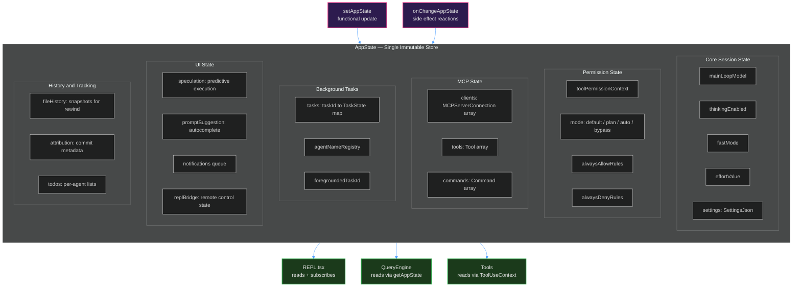
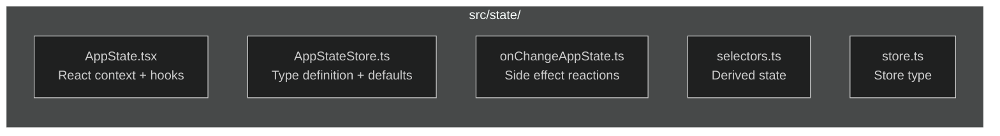

# 6. State Management

> A single immutable store with 50+ fields — how Claude Code manages application state.

---

## Architecture



---

## Core Concepts

### Immutability via `DeepImmutable<T>`

The `AppState` type is wrapped in `DeepImmutable<T>` — TypeScript enforces that no consumer can mutate state in place:

```typescript
export type AppState = DeepImmutable<{
  settings: SettingsJson
  mainLoopModel: ModelSetting
  toolPermissionContext: ToolPermissionContext
  // ... 50+ fields
}>
```

### Functional Updates

State is updated via `setAppState(prev => newState)`:

```typescript
setAppState(prev => ({
  ...prev,
  toolPermissionContext: {
    ...prev.toolPermissionContext,
    mode: 'plan',
  },
}))
```

### Side Effects via `onChangeAppState`

After state changes, `onChangeAppState.ts` fires reactive side effects — persisting settings, updating UI, notifying remote sessions, etc.

---

## Key State Groups

### Session State
`mainLoopModel`, `thinkingEnabled`, `fastMode`, `effortValue` — control how the model behaves each turn.

### Permission State
`toolPermissionContext` — contains mode, allow/deny rules, and bypass availability. See [Guide 4](./04-permission-system.md).

### MCP State
`mcp.clients`, `mcp.tools`, `mcp.commands` — dynamically connected MCP servers and their exposed tools/commands.

### Background Tasks
`tasks` — a map of `taskId → TaskState` for background agent tasks. `foregroundedTaskId` controls which task's messages appear in the main view.

### UI State
`speculation` — predictive execution state for pre-computing responses. `promptSuggestion` — autocomplete suggestions. `notifications` — queued UI notifications.

### History
`fileHistory` — snapshots for `/rewind`. `attribution` — commit metadata for git attribution. `todos` — per-agent task lists.

---

## Key Files



---

**Previous:** [← Context Management](./05-context-management.md) · **Next:** [Extension Model →](./07-extension-model.md)
