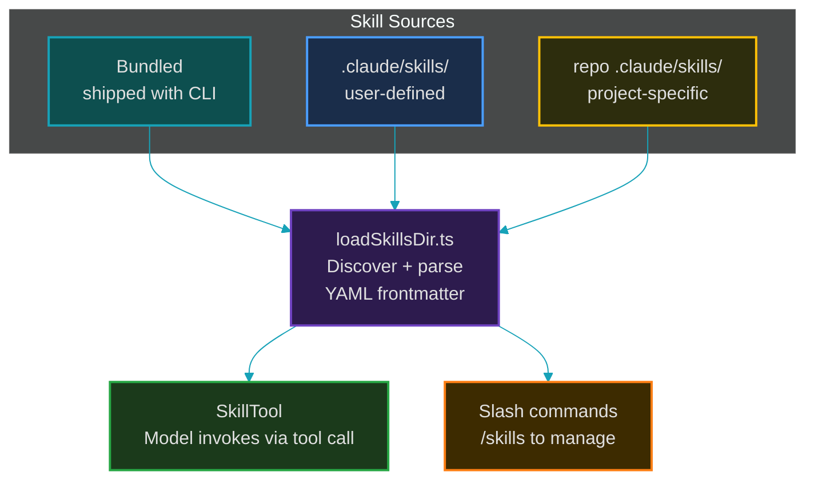
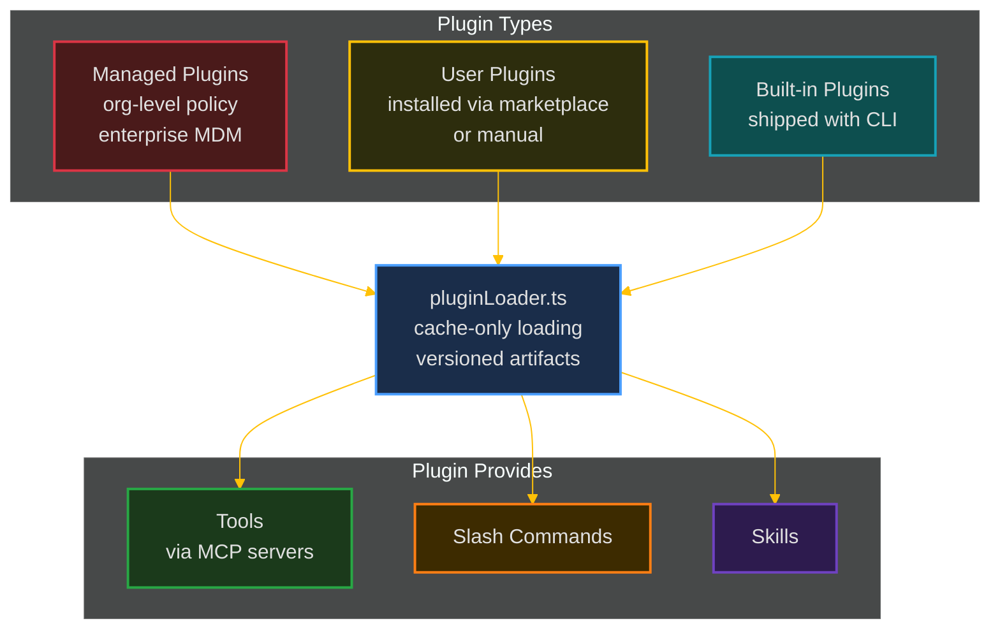
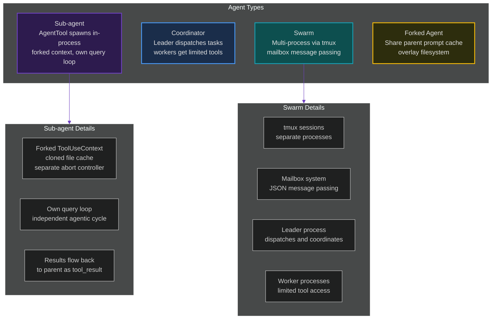
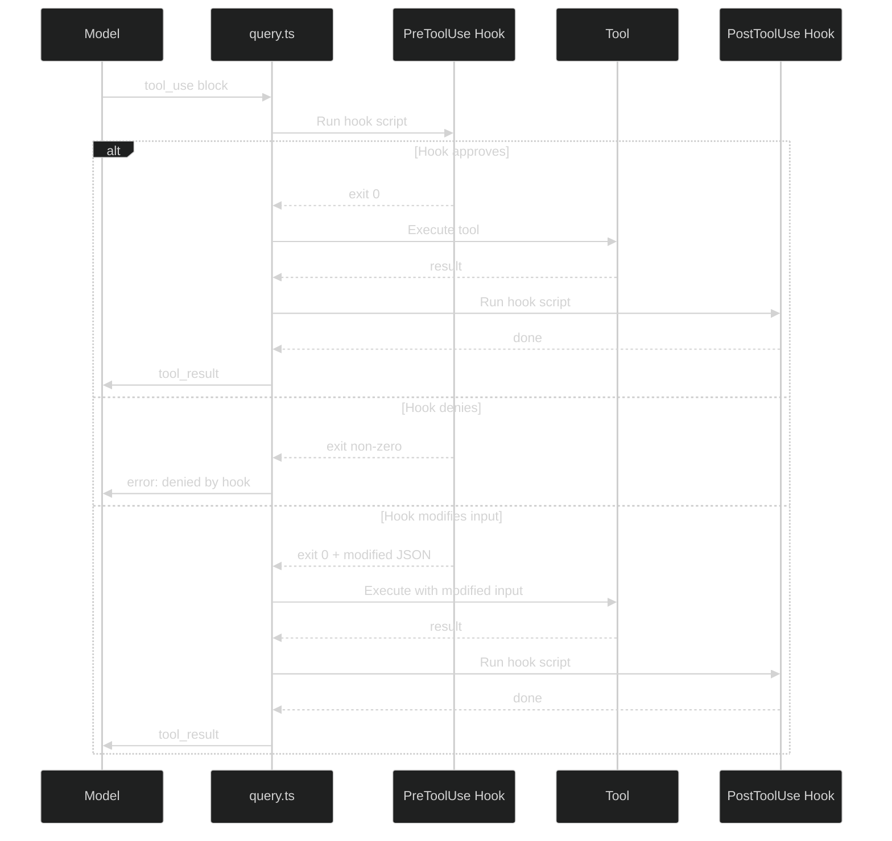

# 7. Extension Model

> Skills, plugins, hooks, sub-agents, and swarms — how Claude Code is extended.

---

## Overview

```mermaid
%%{init: {'theme': 'dark', 'themeVariables': { 'primaryColor': '#1a1a2e', 'primaryTextColor': '#e0e0e0', 'lineColor': '#ffc107', 'primaryBorderColor': '#ffc107'}}}%%
graph TB
    subgraph Skills["Skills"]
        BS["Bundled Skills<br/>shipped with CLI"]:::skill
        US["User Skills<br/>.claude/skills/*.md"]:::skill
        PS["Project Skills<br/>.claude/skills/ in repo"]:::skill
        SL["loadSkillsDir.ts<br/>discover + parse frontmatter"]:::loader
    end

    subgraph Plugins["Plugins"]
        MP["Managed Plugins<br/>org-level policy"]:::plugin
        IP["Installed Plugins<br/>user choice"]:::plugin
        BP["Built-in Plugins<br/>shipped with CLI"]:::plugin
        PL["pluginLoader.ts<br/>cache-only, versioned"]:::loader
    end

    subgraph Agents["Agents"]
        SA["Sub-agents via AgentTool<br/>forked context, own query loop"]:::agent
        CO["Coordinator Mode<br/>leader dispatches tasks,<br/>workers get limited tools"]:::agent
        SW["Swarms<br/>multi-process via tmux,<br/>mailbox message passing"]:::agent
        FA["Forked Agents<br/>share parent prompt cache,<br/>overlay filesystem"]:::agent
    end

    subgraph HookSys["Hooks"]
        PRE["PreToolUse<br/>before tool execution"]:::hook
        POST["PostToolUse<br/>after tool execution"]:::hook
        SESS["Session Hooks<br/>lifecycle events"]:::hook
        HC["Configured in<br/>settings.json or CLAUDE.md"]:::hook
    end

    CMD["commands.ts — Command Registry<br/>merges all sources"]:::registry
    TOOL["Tool.ts — Tool Interface"]:::registry
    QUERY["query.ts — Agentic Loop"]:::registry

    BS --> SL
    US --> SL
    PS --> SL
    SL --> CMD

    MP --> PL
    IP --> PL
    BP --> PL
    PL --> CMD
    PL -->|"plugin MCP servers"| TOOL

    CMD --> TOOL

    SA --> QUERY
    CO --> QUERY
    SW --> QUERY
    FA --> QUERY

    PRE --> TOOL
    POST --> TOOL
    HC --> PRE
    HC --> POST

    classDef skill fill:#0d4f4f,stroke:#17a2b8,color:#e0e0e0,stroke-width:2px
    classDef plugin fill:#2d2d0d,stroke:#ffc107,color:#e0e0e0,stroke-width:2px
    classDef agent fill:#2d1b4e,stroke:#6f42c1,color:#e0e0e0,stroke-width:2px
    classDef hook fill:#3d2b00,stroke:#fd7e14,color:#e0e0e0,stroke-width:2px
    classDef loader fill:#1a2d4a,stroke:#4a9eff,color:#e0e0e0,stroke-width:2px
    classDef registry fill:#1b3a1b,stroke:#28a745,color:#e0e0e0,stroke-width:3px
```



---

## Skills

Skills are **markdown instruction files** with YAML frontmatter. They teach Claude Code how to do specific tasks.



**Key file:** `src/skills/loadSkillsDir.ts` (34KB)

---

## Plugins

Plugins are bundles of tools, MCP servers, and commands. They extend Claude Code at a deeper level than skills.



**Key files:** `src/plugins/builtinPlugins.ts`, `src/utils/plugins/pluginLoader.ts`

---

## Agent System

Claude Code can spawn **sub-agents** — each gets its own query loop, forked context, and limited tool set.



**Key files:** `src/tools/AgentTool/`, `src/coordinator/coordinatorMode.ts`

---

## Hooks

User-defined scripts that run at specific points in the tool execution lifecycle:



Hooks are configured in `settings.json` with matchers:

```json
{
  "hooks": {
    "PreToolUse": [
      { "matcher": "Bash", "command": "./check-safety.sh" }
    ],
    "PostToolUse": [
      { "matcher": "FileWrite", "command": "./format-on-save.sh" }
    ]
  }
}
```

---

**Previous:** [← State Management](./06-state-management.md) · **Next:** [API Client →](./08-api-client.md)
