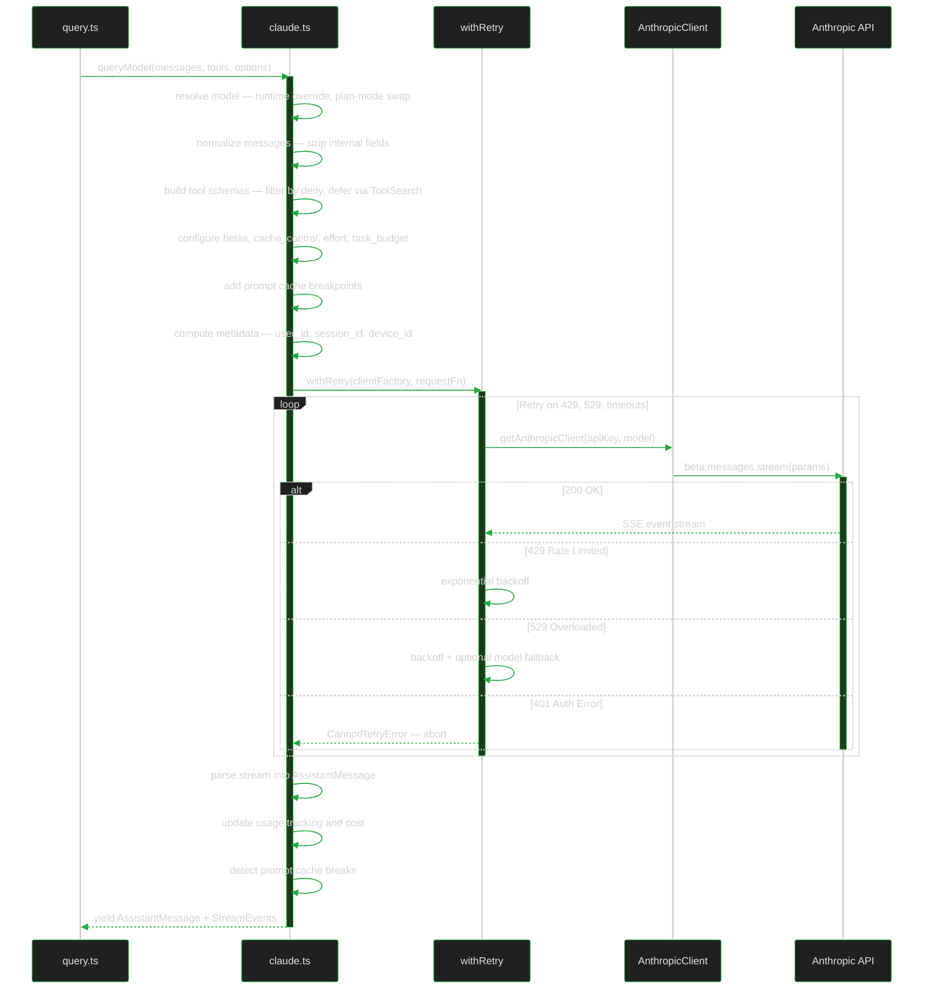
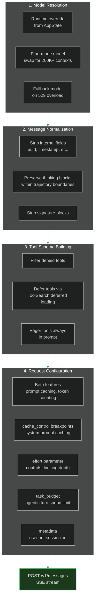
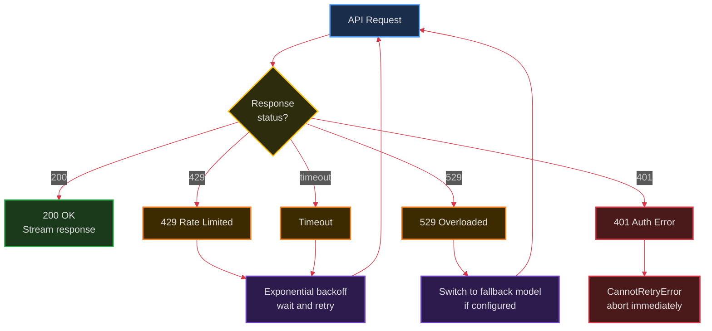
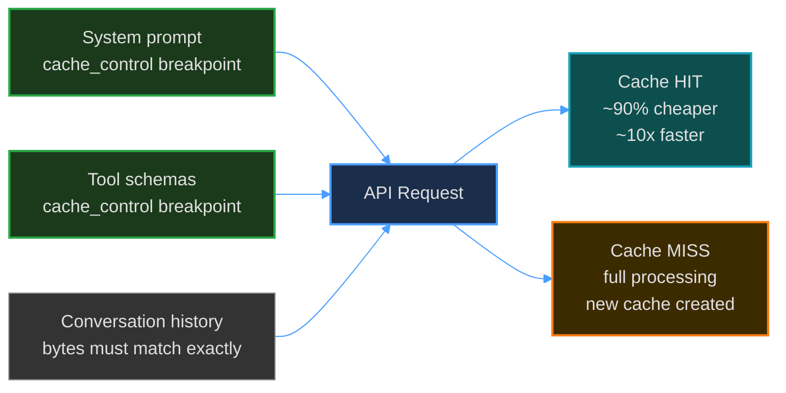
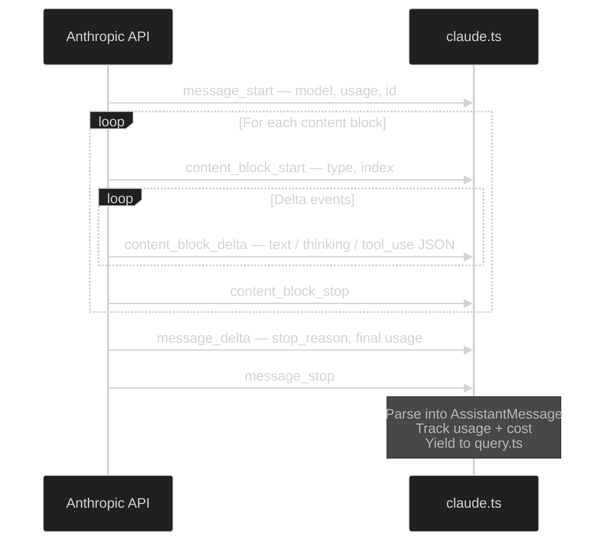

# 8. API Client — `claude.ts`

> Streaming, retries, caching, and model fallback — how Claude Code talks to the Anthropic API.

---

## Request Lifecycle

---

## Request Building

Before each API call, `claude.ts` builds the request through several steps:

---

## Retry Logic — `withRetry`

The retry wrapper handles transient API failures:

### Streaming Fallback

A unique feature: if the model is overloaded mid-stream (529), Claude Code can:
1. **Tombstone** the partial assistant messages
2. Switch to a fallback model
3. Restart the stream from scratch
4. The user sees no interruption — orphaned messages are removed from UI

---

## Prompt Caching

Claude Code uses Anthropic's prompt cache to avoid re-processing unchanged context:

Cache breaks are detected and logged. The `backfillObservableInput()` pattern exists specifically to avoid breaking the cache — the original API-bound input is never mutated.

---

## SSE Stream Events

The API returns Server-Sent Events in this order:

---

## Cost Tracking

Every API call's usage is tracked in `cost-tracker.ts`:
- Input tokens (including cache reads/writes)
- Output tokens
- Per-model pricing
- Session totals exposed via `/cost` command

---

**Previous:** [← Extension Model](./07-extension-model.md) · **Next:** [UI Architecture →](./09-ui-architecture.md)
