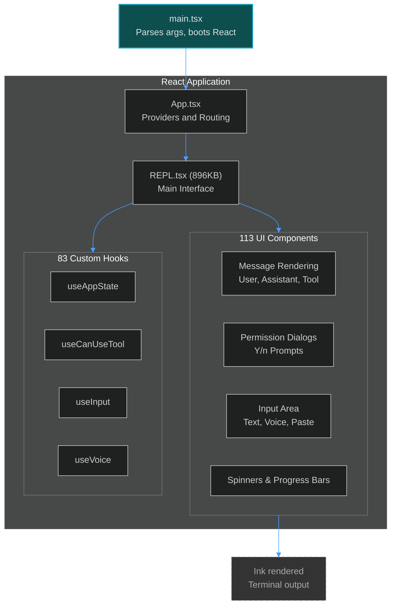
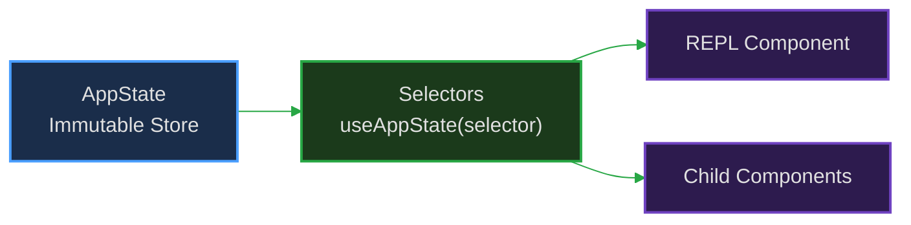

# 9. UI Architecture

> Building a complex, interactive terminal UI with React and Ink.

---

## Overview

Claude Code uses React (via [Ink](https://github.com/vadimdemedes/ink)) to render its terminal interface. This allows it to use React's declarative component model, hooks, and state management in a CLI context.

---

## The REPL

The core of the interface is `REPL.tsx` (896KB). It manages the main interaction loop from the UI perspective, orchestrating input, rendering the conversation history, and handling background tasks.

### Key Responsibilities

1. **Virtual Scrolling**: The terminal can't hold infinite text. The REPL implements virtual scrolling, only rendering the messages that fit in the viewport plus a small buffer, while maintaining the illusion of a continuous scrollback.
2. **Input Handling**: Manages the text input area, handling multiline input, pasting files/images, keyboard shortcuts (including vim mode), and voice input.
3. **Task Foregrounding**: Only one agent task can write to the terminal at a time. The REPL manages which task is "foregrounded" and visible.
4. **State Synchronization**: Subscribes to the single immutable `AppState` store to trigger re-renders when data changes.

---

## Component Architecture

Claude Code breaks down the UI into 113 specialized components.

### Message Rendering

Each message type has a dedicated component:

- `UserMessage`: Renders user input.
- `AssistantMessage`: Renders markdown text from the model, handling streaming updates gracefully.
- `ToolUseMessage`: Displays the execution in progress (e.g., a spinner and the command being run).
- `ToolResultMessage`: Shows the outcome, often truncating long outputs and providing "Show More" functionality.

### Layout and Styling

Ink uses Yoga (a Flexbox engine) for layout. Components are composed using Flexbox principles, allowing for responsive terminal designs that adapt to the window size.

---

## State and Hooks

The UI is deeply integrated with the `AppState` store.

Custom hooks encapsulate complex logic:
- `useInput`: Handles raw stdin data, necessary for keyboard shortcuts that bypass normal text input.
- `useCanUseTool`: Connects a UI prompt to the permission system, pausing the engine until the user responds.

---

**Previous:** [← API Client](./08-api-client.md)
