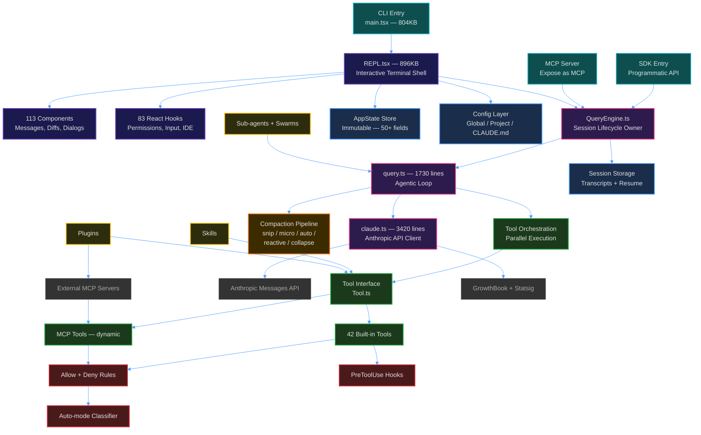

# Learn Claude Code Architecture

> A deep-dive educational guide into the internal architecture of Anthropic's Claude Code CLI — the agentic coding assistant that leaked via a `.map` file in March 2026.

**Internal Codename:** Tengu  
**Runtime:** Bun  
**UI Framework:** React + Ink (React for CLI)  
**Language:** TypeScript (strict)  
**Scale:** ~1,900 files, 512,000+ lines of code

---

## Why This Guide Exists

Claude Code is one of the most sophisticated agentic AI systems ever built. Its architecture contains lessons in:

- **Agentic loop design** — How to build a multi-turn, tool-calling AI agent
- **Terminal UI at scale** — 113 React components running in a terminal
- **Permission systems** — Layered security for autonomous code execution
- **Context management** — Keeping conversations within token limits
- **Extension architectures** — Plugins, skills, hooks, and sub-agents

Whether you're building your own AI agent, contributing to open-source AI tools, or just curious about how the sausage is made — this guide is for you.

---

## Guide Structure

Start from the top and work down, or jump to whatever interests you:

| # | Guide | What You'll Learn |
|---|-------|-------------------|
| 1 | [System Overview](./01-system-overview.md) | Bird's-eye view of every layer — entries, UI, core engine, tools, state |
| 2 | [The Agentic Loop](./02-agentic-loop.md) | How `query.ts` drives the model → tool → model cycle |
| 3 | [Tool System](./03-tool-system.md) | How 42 built-in tools are defined, validated, and executed |
| 4 | [Permission System](./04-permission-system.md) | Deny rules, allow rules, hooks, classifier, user prompts |
| 5 | [Context Management](./05-context-management.md) | Snip, micro, auto, reactive compact — the full pipeline |
| 6 | [State Management](./06-state-management.md) | AppState store, immutability, and reactive side effects |
| 7 | [Extension Model](./07-extension-model.md) | Skills, plugins, hooks, sub-agents, and swarms |
| 8 | [API Client](./08-api-client.md) | `claude.ts` — streaming, retries, caching, and model fallback |
| 9 | [UI Architecture](./09-ui-architecture.md) | React Ink, 113 components, and the 896KB REPL |

---

## Key Files Quick Reference

| File | Size | Role |
|------|------|------|
| `src/main.tsx` | 804KB | CLI entrypoint — Commander.js parser + React/Ink bootstrap |
| `src/screens/REPL.tsx` | 896KB | Interactive terminal shell — the heart of the UI |
| `src/query.ts` | 1,730 lines | The agentic loop — model ↔ tool cycling |
| `src/QueryEngine.ts` | 1,296 lines | Session lifecycle owner — wraps `query()` |
| `src/Tool.ts` | 793 lines | Tool interface definition — every tool implements this |
| `src/commands.ts` | ~25K | Slash command registry |
| `src/state/AppStateStore.ts` | 570 lines | Immutable store with 50+ fields |
| `src/services/compact/` | 11 files | The entire compaction pipeline |

---

## Architecture At A Glance

---

## Prerequisites

To get the most out of these guides, you should be comfortable with:

- **TypeScript** — The entire codebase is strict TypeScript
- **React** — The UI uses React (via Ink for the terminal)
- **Async generators** — The agentic loop and streaming are built on `async function*`
- **LLM APIs** — Familiarity with the Anthropic Messages API helps

---
